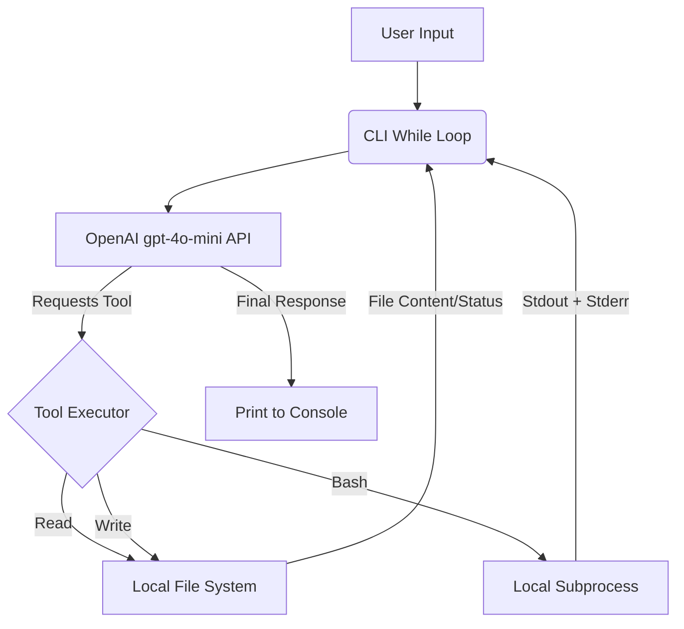

# Python Coding Agent

A lightweight, framework-free AI coding agent built entirely from scratch to perform local file system operations and shell command execution.


## Project Card

| Field | Value |
|-------|-------|
| Experiment ID | EXP-001 |
| Difficulty | Beginner |
| Build Time | ~2 Hours |
| Tech Stack | Python, OpenAI API |
| Video | [Link](https://www.youtube.com/watch?v=oOKBC57IeOI&list=PLFf9tFmijLOE) |


## Overview

This project is a minimalist AI coding agent built from scratch using the native OpenAI Python SDK. It exists to demonstrate the fundamental mechanics of agentic loops and tool calling without relying on heavy orchestration frameworks like LangChain or LangGraph.

The agent is designed for AI engineers and developers who want to understand the raw interactions between an LLM and a local environment. It operates directly via a command-line interface, taking user requests and autonomously deciding which local system tools to invoke.


## Features

*   **Zero-Framework Architecture:** Operates on a simple standard Python `while` loop.
*   **Native Tool Calling:** Utilizes OpenAI's native function calling format.
*   **File System Access:** Includes custom `Read` and `Write` tools to inspect and modify local files.
*   **Shell Execution:** Features a `Bash` tool to execute shell commands and capture both standard output and errors.
*   **Self-Correction:** Feeds tool execution results (like bash `stderr`) back into the message history for iterative problem solving.


## Architecture



The application runs an infinite `while` loop that captures standard terminal input [cite: 9]. The conversation history is maintained in a simple Python list. 

When the user issues a command, the LLM analyzes the request and may return one or multiple tool calls. The Python script parses the JSON arguments provided by the LLM and executes the corresponding local function (`Read`, `Write`, or `Bash`). Crucially, the outputs of these actions (including bash script errors) are appended back to the message history, allowing the LLM to verify its work or correct its mistakes in subsequent iterations.


## Tech Stack

| Category | Technology |
|---|---|
| Language | Python |
| LLM API | OpenAI (gpt-4o-mini) |
| Environment setup | python-dotenv |
| Execution | Subprocess Module |


## Quick Start

### 1. Install Dependencies
```bash
pip install openai python-dotenv
```

### 2. Configure Environment
Ensure your `.env` file contains your OpenAI API key:
```env
OPENAI_API=sk-your-api-key
```

### 3. Run the Agent
```bash
python main.py
```

## Example

**Terminal Output:**
```text
User: Create a new python file called hello.py that prints "Hello World", then run it.

 [FILE CONTENT]: 
 File written successfully.

 Agent: I have created the file `hello.py` and it successfully outputted:
"Hello World"
```


## Challenges

*   **Context Window Exhaustion:** Because the raw message list appends every user prompt, tool call, and tool response without truncation, the context window can quickly fill up during long debugging sessions.
*   **Security Risks:** The `Bash` tool passes commands directly to the underlying shell (`shell=True`) without a sandbox. This grants the LLM root-level access to the host machine if run without strict permission boundaries.
*   **JSON Parsing Brittleness:** Native tool arguments are returned as JSON strings. Occasional LLM hallucination of malformed JSON can crash the standard `json.loads()` parser.


## Design Decisions

*   **Why build from scratch instead of using LangGraph?** To eliminate "black box" magic. Understanding how to manually append `tool_call_id` and `role: tool` messages is critical for debugging complex agent frameworks later.
*   **Why include Bash execution?** Giving the agent shell access allows it to autonomously test the code it writes, install missing dependencies, and inspect system architecture, making it a true autonomous developer rather than just a code generator.
*   **Why merge stdout and stderr?** By combining `result.stdout + result.stderr`, the LLM instantly sees if its bash command failed (e.g., a syntax error or missing module) and can attempt to fix it in the next generation cycle.

---

## Lessons Learned

*   Agent orchestration frameworks abstract away a significant amount of boilerplate message management.
*   Strict exception handling around `json.loads` is required for production-ready agents, as LLMs occasionally output invalid JSON.
*   Providing raw error stack traces to the LLM via the `Bash` tool is a highly effective way to trigger autonomous self-correction.