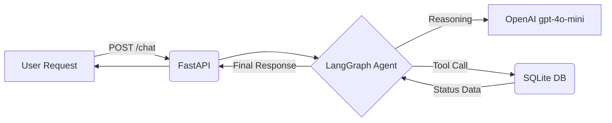

# Order Tracking AI Agent

An enterprise-ready AI Agent designed to handle customer order inquiries by interacting with an internal database.


## Project Card

| Field | Value |
|-------|-------|
| Experiment ID | EXP-002 |
| Difficulty | Intermediate |
| Build Time | ~4 Hours |
| Tech Stack | FastAPI, LangGraph, SQLite, Docker |
| Video | ⏳ |


## Overview

This project is an enterprise-ready AI Agent designed to handle customer order inquiries. It demonstrates how to move beyond simple chat wrappers and create autonomous agents capable of Tool Calling and interacting with internal databases.

The system relies on LangGraph to manage state and routing, dynamically deciding when to answer the user directly versus when to query the database for real-time order statuses.

It serves as a reference implementation for AI engineers looking to integrate LLMs with traditional REST APIs and relational databases while maintaining complete system observability.


## Features

*   **Agentic Workflow:** Uses LangGraph to manage state and routing (deciding when to answer vs. when to query the database).
*   **Tool Calling:** Custom Python tools connected to a mock SQLite database to retrieve real-time order status.
*   **RESTful API:** Served via FastAPI for easy integration with frontend interfaces or customer support platforms.
*   **Containerization:** Fully containerized for seamless deployment.
*   **Observability:** Fully integrated with LangSmith to monitor LLM token usage, tool execution latency, and agent decision-making processes.


## Architecture



The system exposes a REST API via FastAPI. When a user submits an order inquiry, the payload is routed to a stateful LangGraph agent. 

The agent utilizes OpenAI's model to parse the user's intent. If an order number is detected, the LLM triggers a predefined tool bound to a local SQLite database via SQLAlchemy. The tool executes the SQL query, returns the matching shipping record, and allows the agent to synthesize an accurate, grounded response. 


## Tech Stack

| Category | Technology |
|---|---|
| Frameworks | FastAPI, LangGraph, LangChain |
| LLM | OpenAI (gpt-4o-mini) |
| Database | SQLite, SQLAlchemy |
| Environment | Docker, Python 3.11 |
| Observability | LangSmith |
| Server | Uvicorn |


## Quick Start

```bash
docker-compose up --build
```
*The API interactive documentation will be available at: `http://localhost:8000/docs`*


## Example

**Request:**
```json
{
  "message": "Hi, what is the status of my order? The order number is ORD-71139"
}
```

**Internal Execution:**
The agent parses the request and executes the database tool (`get_order_starus`) with the argument `order_number: ORD-71139`. 

**Response:**
> "Your order ORD-71139 for Brandon Lewis is currently in 'Shipped' status.
> - Shipping Address: 344 Mcguire Turnpike Apt. 034, Masonside, MN 21251
> - Estimated Delivery Date: July 5, 2026"

*(Execution flow and tool latency can be observed in the provided [`trace.png`](./002-order-tracking-agent/trace.png))*


## Challenges

*   **Hallucination Prevention:** Ensuring the LLM does not confidently invent delivery dates for invalid order numbers.
*   **Tool Typos & Naming:** Dealing with minor typos in tool definitions (e.g., `get_order_starus` instead of `status`), which can confuse model execution if strict schema binding isn't enforced. 
*   **Latency Overhead:** Orchestrating LangGraph cycles and LangSmith tracing adds marginal latency compared to single-shot LLM inferences.


## Design Decisions

*   **Why LangGraph over standard LangChain Agents?** Standard agents operate as "black boxes." LangGraph provides explicit control over the cyclic nature of tool calling, making it easier to debug state changes and enforce strict routing rules.
*   **Why FastAPI?** It provides automatic, interactive OpenAPI documentation out of the box and natively handles the asynchronous I/O operations required for LLM network requests.
*   **Why gpt-4o-mini?** It offers an optimal balance of low cost and high speed while maintaining the strict instruction-following capabilities required for reliable JSON tool calling.
*   **Why SQLite?** Used as a lightweight, file-based database to mock enterprise ERP data without requiring heavy infrastructure setup or external network connections for the experiment.


## Lessons Learned

*   Explicit instructions in the system prompt are critical; models will default to conversational filler if not strictly told to rely only on tool outputs.
*   Integrating observability (LangSmith) early saves hours of debugging by visualizing the exact payload passed between the LLM and the Python tool.
*   Dockerizing AI applications immediately circumvents dependency conflicts common with rapidly updating libraries like LangChain and FastAPI.
