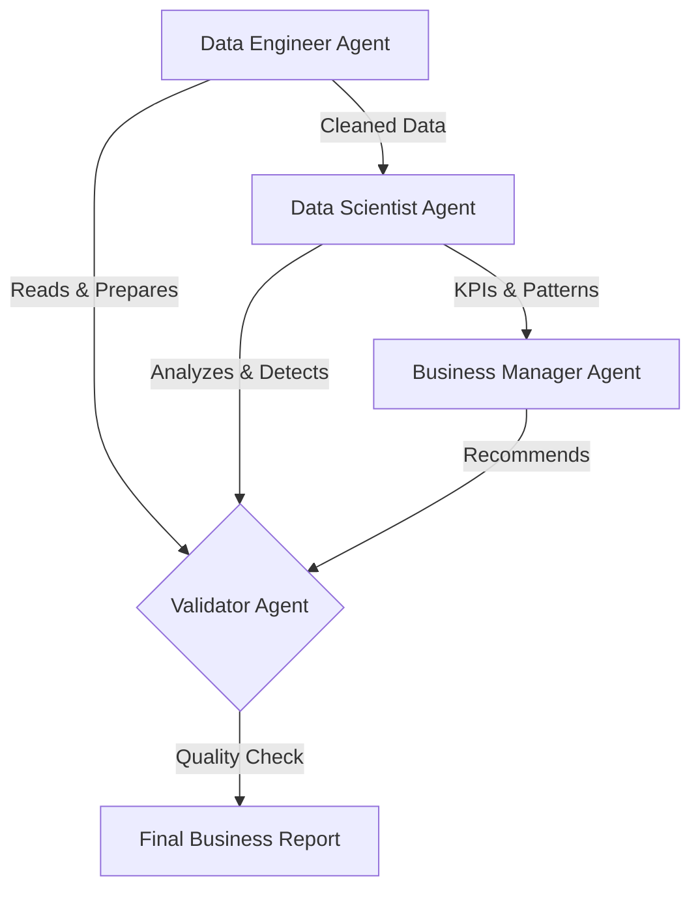

# Multi-Agent Data Analyst

An autonomous Business Intelligence system using multi-agent collaboration to analyze data and generate actionable insights like a senior consultant.


## Project Card

| Field | Value |
|-------|-------|
| Experiment ID | EXP-003 |
| Difficulty | Advanced |
| Build Time | ~4 Hours |
| Tech Stack | Python, Jupyter, OpenAI API |
| Video | ⏳ |


## Overview

This project is a multi-agent data analyst system that by passes traditional, static BI dashboards. It reads and processes raw data directly, proposing deep analyses and operational recommendations through a coordinated team of AI agents.

It exists to demonstrate how multi-agent architectures can replicate the workflow of a human data team. This repository is intended for AI engineers exploring complex task delegation, sequential agent handoffs, and autonomous data analysis.


## Features

*   **Multi-Agent Workflow:** Replicates a full data team (Engineer, Scientist, Manager, Validator).
*   **Autonomous Execution:** Directly analyzes CSV data without pre-built SQL aggregations.
*   **Custom Tooling:** Provides agents with specific Python tools to calculate KPIs and detect anomalies.
*   **Built-in Validation:** Includes a dedicated validation agent to ensure output quality and consistency.
*   **Configurable Context:** Easily adaptable to different company domains via dynamic system prompts.


## Architecture



The system operates on a sequential pipeline where tasks are delegated to specialized personas, overseen by a validation layer.

### Agent Team

*   **Data Engineer:** Reads and prepares the raw data. It identifies missing values, formats columns, and flags data quality issues using tools like `read_csv_data` and `get_data_summary`.
*   **Data Scientist:** Ingests the cleaned data to calculate core KPIs and detect statistical anomalies using tools like `execute_analysis` and `calculate_kpis`.
*   **Business Manager:** Takes the quantitative findings from the Data Scientist and translates them into strategic, actionable business recommendations.
*   **Validator:** Acts as the final quality control checkpoint. It does not use external tools but reviews the entire pipeline's output for logical consistency, formatting accuracy, and hallucination prevention.


## Tech Stack

| Category | Technology |
|---|---|
| Language | Python 3.10+ |
| Environment | Jupyter Notebook |
| LLM | OpenAI API |
| Data Processing | pandas |


## Quick Start

### 1. Installation
Clone the repository and install dependencies:
```bash
git clone https://github.com/YOUR_USERNAME/agentic-bi.git
cd agentic-bi
pip install -r requirements.txt
```

### 2. Configuration
Set your OpenAI API key inside the notebook environment:
```python
import os
os.environ['OPENAI_API_KEY'] = 'sk-your-api-key-here'
```
You can also edit the `COMPANY_CONTEXT` variable in the notebook to customize the system for your specific business model.

### 3. Usage
**Run individual agents (Testing):**
```python
# Test one agent at a time
data_result = data_engineer_agent()
```

**Run the full pipeline:**
```python
# Execute all agents in sequence
final_results = run_bi_pipeline(validate=True)
```

## Sample Data

The project ships with `stripe_payments_dataset.csv`, a simulated Stripe dataset containing:
- **696 transactions**
- **€40,880 total revenue**
- **3 Segments:** Basic, Pro, Enterprise
- **4 Countries:** DE, FR, ES, IT
- **3 Channels:** Organic, Ads, Email


## Challenges

*   **Context Window Limits:** Passing raw transaction rows between four different agents quickly exhausts token limits. The Data Engineer must summarize the data effectively before passing it down the chain.
*   **Tool Execution Errors:** If the Data Scientist agent hallucinates a pandas function or misuses a custom tool, the error cascades to the Business Manager. 
*   **Agent Drift:** As the conversation lengthens, the Business Manager sometimes loses track of the initial system context (e.g., specific company goals).


## Design Decisions

*   **Why a Multi-Agent Architecture?** Single-agent setups fail when asked to code, analyze, and write business strategy simultaneously. Splitting the roles ensures the LLM's attention mechanism remains focused on a single narrow objective per step.
*   **Why include a Validator Agent?** LLMs are prone to confidently presenting flawed math. The Validator acts as an automated "human-in-the-loop," critically reviewing the Data Scientist's KPIs against the Business Manager's claims before final output.
*   **Why Jupyter Notebook?** It allows engineers to inspect the intermediate state (the raw output of each agent) sequentially, which is critical for debugging complex agent handoffs.

## Lessons Learned

*   **Specialization over Generalization:** Assigning specific tools to specific agents (e.g., only the Data Scientist gets `detect_anomalies`) prevents the agents from stepping on each other's toes.
*   **Validation is Mandatory:** The addition of a Validator agent drastically reduces hallucinated insights and ensures the final report matches the requested format.
*   **Data Summarization is Key:** AI agents perform better on pre-aggregated data summaries (`get_data_summary`) rather than raw transactional data dumps.
