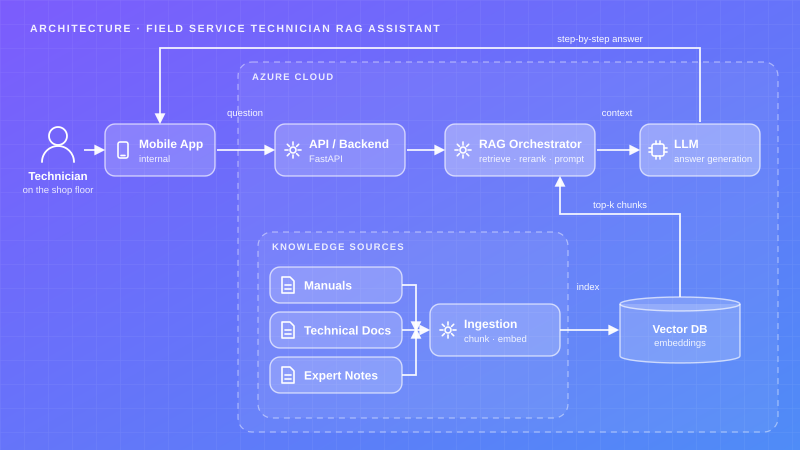
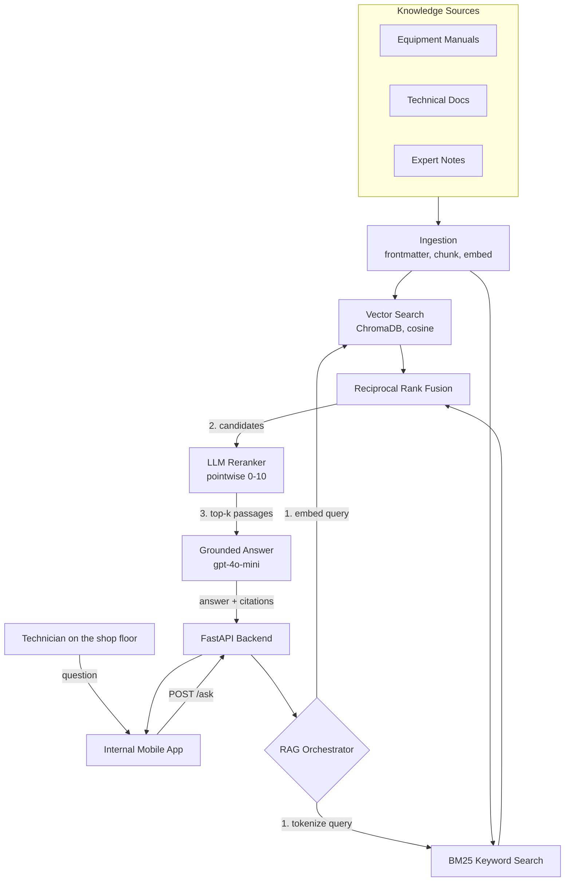

# Field Service Technician RAG Assistant

A mobile-embedded RAG assistant that answers a field technician's repair question from scattered equipment manuals, technical documentation and expert notes — grounded, cited, and fast enough to use while standing in front of the machine.

## Project Card

| Field | Value |
|-------|-------|
| Experiment ID | EXP-004 |
| Difficulty | Advanced |
| Build Time | ~8 Hours |
| Tech Stack | FastAPI, ChromaDB, BM25, OpenAI / Azure OpenAI, Docker |
| Video | ⏳ |

## Overview

A large energy-supply company runs technicians across multiple plants who are responsible for repairing machinery. When a technician is standing in front of a misbehaving machine, they do not always know what is wrong or what step to take next.

The knowledge to answer that already existed — equipment manuals, internal technical documentation, and notes written by more experienced colleagues. The problem was that it was scattered across systems, slow to search, and not something you can flip through while next to a broken compressor.

This experiment builds the retrieval system behind that assistant: an ingestion pipeline over three kinds of internal documentation, hybrid retrieval that handles both alarm codes and plain-language symptom descriptions, an LLM reranking stage, and a grounded answer layer that cites the passage behind every claim. It is served as a REST API so it can be embedded in the internal mobile app technicians already use.

## Features

* **Hybrid Retrieval:** Dense vector search fused with BM25 keyword search via Reciprocal Rank Fusion — exact alarm codes and fuzzy symptom descriptions both work.
* **Heading-Aware Chunking:** Splits on markdown structure, not character count, so a step list or an alarm-code block is never cut in half. Every chunk keeps its heading trail for citation.
* **LLM Reranking:** A cheap pointwise scoring pass reorders fused candidates by meaning before the top few reach the prompt.
* **Mandatory Citations:** Every factual claim in the answer carries a `[n]` marker resolving to a document, section and revision.
* **Source-Type Awareness:** Controlled manuals, technical documents and expert field notes are labelled differently in the prompt, and the model is instructed to flag when a field note contradicts the manual.
* **Safety Surfacing:** Isolation, gas-testing and permit-to-work requirements found in the retrieved context are promoted into a dedicated `SAFETY` line.
* **Equipment Scoping:** An optional equipment tag filters retrieval to that machine plus site-wide documents.
* **Azure or OpenAI:** One environment variable switches the whole pipeline between Azure OpenAI (the production target) and the public API (for reproducing the experiment).

## Architecture





A technician asks a question in plain language from inside the mobile app. The backend embeds the question and runs it through two retrievers in parallel: a cosine vector search over ChromaDB, and a BM25 keyword search over the same corpus.

The two ranked lists are fused with Reciprocal Rank Fusion, which needs no score calibration between the two very different scoring scales. The fused candidate pool — roughly twice the final size — then goes through a pointwise LLM reranker that scores each passage 0–10 for usefulness against the question. Passages scoring below the floor are dropped.

The surviving passages are assembled into a numbered context block, each labelled with its source type and document revision, and handed to the answer model under a system prompt that forbids uncited claims, requires the first action in the first sentence, and requires an explicit note when an expert field note disagrees with the controlled manual.

### The Knowledge Base

The bundled `knowledge_base/` contains synthetic but realistic documentation for three machines, written to reproduce the retrieval problems the real corpus had:

| Source type | Files | What it looks like |
|---|---|---|
| `manual` | GC-200 gas compressor, BFP-40 boiler feed pump, HX-15 heat exchanger | Controlled documents: operating envelopes, alarm-code tables, restart procedures |
| `technical_doc` | Vibration analysis guide, lockout/tagout procedure | Site-wide, tagged `equipment: ALL` so they stay reachable under any equipment filter |
| `expert_note` | Compressor surge notes, feed pump cavitation notes | First-person field experience that deliberately reorders the manual's cause list |

The expert notes contradicting the manuals is the interesting part, and it is intentional. On the GC-200, the manual lists suction strainer fouling as the most frequent cause of surge; the field note says that on this specific unit it was instrument air nine times out of eleven. A RAG system that silently picks one has failed. The prompt requires it to present both and mark which is which.

## Tech Stack

| Category | Technology |
|---|---|
| Language | Python 3.11+ |
| API | FastAPI, Uvicorn, Pydantic v2 |
| Vector Store | ChromaDB (persistent, cosine) |
| Keyword Search | rank-bm25 (Okapi BM25) |
| LLM | OpenAI `gpt-4o-mini`, or Azure OpenAI deployment |
| Embeddings | `text-embedding-3-small` |
| Environment | Docker, docker-compose, python-dotenv |
| Testing | pytest |

## Quick Start

### 1. Configure

```bash
cp .env.example .env
# Add OPENAI_API_KEY, or set AZURE_OPENAI_ENDPOINT + AZURE_OPENAI_API_KEY
```

### 2. Install and Build the Index

```bash
pip install -r requirements.txt
python -m ingestion.ingest
```

```text
Ingesting knowledge base from knowledge_base ...
  indexed 44/44 chunks
{
  "documents": 7,
  "chunks": 44,
  "chunks_by_source_type": {
    "expert_note": 12,
    "manual": 22,
    "technical_doc": 10
  }
}
```

### 3. Ask From the CLI

```bash
python -m rag.orchestrator "the compressor keeps surging, I have E-121 and E-134"
```

### 4. Or Run the API

```bash
docker-compose up --build
# Interactive docs: http://localhost:8000/docs
# Build the index inside the container: curl -X POST http://localhost:8000/ingest
```

### 5. Run the Tests

```bash
pytest -q
```

The tests cover chunking, frontmatter parsing, heading trails and tokenization — the parts where retrieval quality is silently won or lost. They need no API key.

## Example

**Request:**

```json
{
  "question": "The compressor is surging again and I got E-121 then E-134. What do I check first?",
  "equipment": "GC-200"
}
```

**Response:**

> **Most likely:** Instrument air to the anti-surge valve actuator, not the compressor itself — check the air header pressure gauge on the west rack before touching anything on the machine [3].
>
> **Steps:**
> 1. Read the instrument air header pressure at the west rack. Below 5.5 bar(g) means stop here; the surge is a symptom [1][3].
> 2. Compare anti-surge valve position feedback against the command signal on the last 10 minutes of trend. A lag over one second on every stroke is an actuator problem; tracking cleanly with suction flow already collapsed is real aerodynamic surge [3].
> 3. Check the suction strainer differential [3].
> 4. Only then look at the machine itself.
>
> **SAFETY:** Do not reset E-134 more than once without investigating — repeated surge events damage the thrust bearing [1]. Never bypass a trip to restart [1].
>
> **If that is not it:** A genuine aerodynamic surge from suction throttling — confirm the suction block valve line-up was fully reopened after any recent filter change [3]. The controlled manual ranks suction strainer fouling as the most frequent cause [1], while the field note for this unit ranks instrument air first [3]; the note reflects one site's experience, the manual is the controlled document.

**Citations returned alongside:**

```json
[
  {
    "marker": "[1]",
    "title": "Gas Compressor GC-200 - Operation and Maintenance Manual",
    "section": "4. Surge - What It Is and What To Do",
    "source_type": "manual",
    "revision": "4.2",
    "rerank_score": 10.0,
    "matched_by": "vector+keyword"
  },
  {
    "marker": "[3]",
    "title": "Field notes - recurring GC-200 surge events on Unit 3",
    "section": "What actually causes it on Unit 3",
    "source_type": "expert_note",
    "revision": "notes-2026-02",
    "rerank_score": 10.0,
    "matched_by": "vector"
  }
]
```

The `matched_by` field is worth keeping in the response. It shows which retriever found each passage, and it is how you discover that your keyword half is doing nothing — or everything.

## Challenges

* **Alarm codes defeat dense retrieval.** `E-121` and `E-134` embed to almost the same vector as every other alarm code in the corpus. Pure vector search returned the alarm-code section but not the right alarm. BM25 fixes it — but only after fixing the tokenizer, because the default word-boundary split turns `E-121` into `e` and `121`, and `e` matches nothing useful.
* **Fixed-size chunking destroyed procedures.** A 900-character split through the middle of the restart procedure produced answers that confidently gave steps 3 through 5 with no indication that steps 1 and 2 existed. On a safety-relevant procedure that is worse than no answer.
* **Chunks lost their subject.** A chunk reading "Check the level controller first" embeds with no trace of which machine it belongs to, so it surfaced for questions about the compressor. Prefixing every chunk with its document title and heading trail fixed retrieval and gave the citation for free.
* **Metadata filters silently hid the safety documents.** Scoping retrieval to `equipment: GC-200` excluded the lockout/tagout procedure, which is tagged `ALL`. The filter had to become `$in: [equipment, "ALL"]`.
* **The reranker is the latency budget.** One LLM call per candidate is the slowest stage by far. It is worth it for answer quality, but it has to fail open: a reranker exception must leave the passage in the pool on its fusion score, never drop it.

## Design Decisions

* **Why hybrid retrieval instead of just embeddings?** Technician questions come in two shapes that need opposite things. "E-311 keeps tripping" is an exact-token lookup where BM25 wins outright. "It sounds like gravel in the suction end" is a semantic match where BM25 finds nothing. Shipping only one retriever means failing half the questions.
* **Why RRF instead of a weighted score blend?** Cosine similarity and BM25 scores live on incomparable scales, and BM25 scores are not bounded, so a weighted sum needs per-corpus calibration that drifts every time documentation is added. RRF only uses rank position, so it needs no tuning and cannot be broken by a new document with an unusual term distribution.
* **Why a separate LLM reranking stage?** RRF reliably gets the right passages into the candidate pool, but it orders them by rank position rather than by relevance. Since only the top 5 reach the prompt, ordering is what determines the answer. A pointwise 0–10 score from a cheap model is a large quality gain for a modest cost, and it also provides the relevance floor that lets the system say "the documentation does not cover this."
* **Why label source types in the prompt?** Expert notes are often more useful than the manual and simultaneously less authoritative. Collapsing both into undifferentiated "context" makes the model average them into a confident wrong answer. Labelling them lets it report the disagreement, which is what a senior technician would do.
* **Why cite section and revision, not just the document?** "It's in the GC-200 manual" is not actionable on a shop floor. "GC-200 manual rev 4.2, section 4" is something a technician can verify in seconds, and the revision number is what catches an answer grounded in a superseded document.
* **Why keep a JSON chunk sidecar next to the vector store?** BM25 needs the full corpus in memory to build its index, and streaming an entire collection back out of ChromaDB to reconstruct it on every boot is slower and more fragile than writing the chunks once at ingest time.
* **Why Azure behind the same code path?** The production deployment is on Azure, but requiring an Azure subscription to reproduce the experiment would make it unrunnable for most readers. One factory function decides which SDK class to instantiate, and nothing else in the codebase knows the difference.

## Lessons Learned

* Chunking is the highest-leverage decision in a RAG system, and it is almost entirely about document structure rather than token counts. The best retrieval improvement in this build came from splitting on headings and prefixing the heading trail — before any reranker existed.
* Returning which retriever matched each passage turns retrieval from a black box into something debuggable. It is how you find out that a metadata filter has been quietly excluding an entire document class.
* Source provenance is part of the answer, not decoration around it. Instructing the model to distinguish a controlled manual from a field note changed the behaviour from confidently averaging contradictory sources to reporting the contradiction.
* A relevance floor matters more than a better top result. The most damaging failure mode is not a mediocre answer, it is a fluent answer assembled from passages that had nothing to do with the question.
* Every enrichment stage must fail open. A reranker that drops a passage on an API timeout is worse than no reranker, because the failure is invisible in the response.
