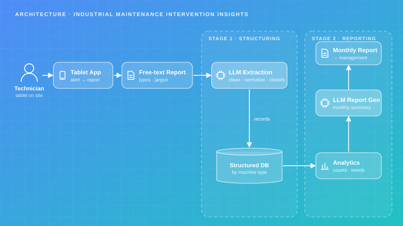
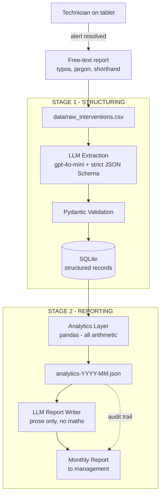

# Industrial Maintenance — Intervention Insights

A two-stage LLM pipeline that turns messy free-text repair reports from a steel plant shop floor into structured records, then into a monthly management report that ranks recurring failures by the downtime they cause.

## Project Card

| Field | Value |
|-------|-------|
| Experiment ID | EXP-005 |
| Difficulty | Intermediate |
| Build Time | ~6 Hours |
| Tech Stack | Python, OpenAI Structured Outputs, Pydantic, SQLAlchemy, pandas |
| Video | ⏳ |

## Overview

An industrial group operates large plants producing steel, iron and related materials. Technicians work from tablets: when part of production stops an alert fires, and once the technician has resolved it — or tried to — they write a free-text account of what the problem was, whether they fixed it, what they did, and any recommendation for next time.

That text is exactly as messy as you would expect from a fast-paced shop floor. Typos, abbreviations, inconsistent technical terminology, occasional shouting in capitals. It held real information, but none of it was usable for reporting or trend analysis as written.

This experiment builds the pipeline that makes it usable. Stage 1 has an LLM read each report, repair the shorthand, extract the facts and map them onto a closed vocabulary, writing a clean record into an internal database. Stage 2 computes the month's statistics in pandas and has an LLM write the management report around those numbers. Management uses the result to decide where to invest, where to allocate budget, and which recurring failure patterns need attention first.

## Features

* **Two-Stage Separation:** Extraction and reporting are independent stages with their own models, so the report writer can be changed without re-processing the archive.
* **Closed-Vocabulary Extraction:** Machine type, failure category, root cause class, severity and resolution are enums, not free text — which is what makes grouping possible at all.
* **Strict Structured Outputs:** A generated JSON Schema with `strict: true` guarantees shape, and Pydantic validates the result before it reaches the database.
* **Symptom vs. Cause:** The schema separates what failed from why it failed, because only the second one is a budget decision.
* **Three-State Resolution:** `resolved` / `temporary_fix` / `not_resolved`, because a boolean cannot represent "tensioned as a temp fix, needs re-lagging".
* **Arithmetic Outside the LLM:** Every number in the report is computed in pandas. The model is explicitly forbidden from calculating anything.
* **Repeat-Offender Detection:** Cross-month grouping by equipment and failure category, ranked by downtime — the output management actually acts on.
* **Confidence Flagging:** Low-confidence extractions are stored and flagged, never dropped, and surface as a data-quality note on the report.
* **Auditable Reports:** Each report is saved next to the exact analytics JSON it was written from.

## Architecture





The pipeline never lets the two stages touch. Stage 1 reads one report at a time and produces exactly one validated record; it does not see the corpus and cannot produce a trend. Stage 2 never sees raw text; it reads the structured table, computes every figure in pandas, and hands the model a finished analytics object to write prose around.

That boundary is the reason the report can be trusted. An LLM asked to total downtime across fifty records will produce a number that looks right, and checking it costs as much as computing it properly in the first place.

### The Extraction Schema

| Field | Type | Why it is there |
|---|---|---|
| `summary` | str | The report in one clean sentence, so a manager never reads raw shorthand |
| `machine_type` | enum (11) | The grouping axis for the report |
| `component` | str | Normalised lowercase terminology — the same part gets the same name every time |
| `failure_category` | enum (11) | What failed |
| `root_cause_class` | enum (10) | Why it failed — the field that drives budget decisions |
| `root_cause_detail` | str | The specific cause, empty when the report does not state one |
| `resolution` | enum (3) | `resolved` / `temporary_fix` / `not_resolved` |
| `downtime_minutes` | int | `-1` when unstated, never estimated |
| `planned_work` | bool | Separates shutdown work from breakdown response |
| `recurring` | bool | True only when the report itself signals repetition |
| `recommendation` | str | The technician's own suggestion, rewritten clearly |
| `escalation_needed` | bool | Technician is asking for engineering or a design change |
| `extraction_confidence` | float | Below 0.6 means the source was too ambiguous to trust |

### The Sample Data

`data/raw_interventions.csv` contains 55 synthetic intervention reports across three plants and three months, written in genuine shop-floor register:

```text
"hyd leak on the main cyl again, 3rd time this qtr. found the seal on rod side
blown. replced seal kit + topped up oil. down abt 95 min. RECOMEND we change the
whole cyl at next shutdwn, seals keep going becuse rod is scored"
```

The data contains deliberate narrative threads, because a report that only counts things is not worth generating. The HRM-01 hydraulic cylinder fails three times before being replaced. The BF-01 stave strainers keep blocking with rubber until a technician traces it to a shedding expansion joint liner that engineering then sits on for three weeks. Three caster segment bearings fail from the same crimped autolube line before the routing is redesigned. Those are the stories the monthly report is supposed to find, and they are only visible once the text is structured.

## Tech Stack

| Category | Technology |
|---|---|
| Language | Python 3.11+ |
| LLM | OpenAI `gpt-4o-mini` with strict structured outputs |
| Validation | Pydantic v2 |
| Database | SQLite, SQLAlchemy 2.0 |
| Analytics | pandas |
| Environment | python-dotenv |
| Testing | pytest |

## Quick Start

### 1. Configure

```bash
cp .env.example .env    # add OPENAI_API_KEY
pip install -r requirements.txt
```

### 2. Stage 1 — Structure the Free Text

```bash
python main.py structure
```

```text
Structuring interventions from data/raw_interventions.csv ...
  [  1] INT-2026-0101 -> hydraulic_leak / wear_end_of_life (0.95)
  [  2] INT-2026-0102 -> instrument_or_sensor / environmental_ingress (0.90)
  [  3] INT-2026-0103 -> mechanical_wear / misalignment_or_looseness (0.85)
  ...
{
  "total": 55,
  "structured": 55,
  "skipped": 0,
  "failed": 0,
  "low_confidence": 2
}
```

### 3. See What One Record Became

```bash
python main.py inspect INT-2026-0109
```

### 4. Stage 2 — Generate the Monthly Report

```bash
python main.py analytics --month 2026-02    # the computed numbers
python main.py report --month 2026-02       # the report written from them
python main.py report --all                 # one per month
```

Reports land in `reports/` alongside the analytics JSON they were written from.

### 5. Run the Tests

```bash
pytest -q
```

Nine tests over the analytics layer and the schema generator. No API key needed.

## Example

**Raw input, as typed on the tablet:**

```text
INT-2026-0109  HRM-01  2026-01-14

"same hyd leak main cyl HRM-01. rod side seal. did seal kit again. 85min. as i
said before the rod is scored, this will keep repeating until cyl is changed.
escalated to eng"
```

**After stage 1:**

```json
{
  "summary": "Recurring hydraulic leak on the HRM-01 main cylinder rod-side seal; seal kit replaced again.",
  "machine_type": "rolling_mill",
  "component": "hydraulic cylinder rod seal",
  "failure_category": "hydraulic_leak",
  "root_cause_class": "deferred_repair",
  "root_cause_detail": "cylinder rod is scored, causing repeated seal failure",
  "action_taken": "Replaced the seal kit.",
  "resolution": "temporary_fix",
  "severity": "high",
  "downtime_minutes": 85,
  "planned_work": false,
  "parts_replaced": ["hydraulic seal kit"],
  "recurring": true,
  "recommendation": "Replace the complete cylinder; seals will keep failing while the rod is scored.",
  "escalation_needed": true,
  "extraction_confidence": 0.95
}
```

Note what the model got right that a regex never would: `resolution` is `temporary_fix` even though the technician describes completed work, because the same sentence says it will keep repeating. And `root_cause_class` is `deferred_repair` rather than `wear_end_of_life`, because the cause is not that the seal wore out — it is that a known fix has not been done.

**After stage 2 (excerpt):**

> # Maintenance Report - 2026-02
>
> ## Headline
> 18 interventions this month, 4 of them planned, for 1,415 minutes of recorded downtime — up 21% on January. The story of the month is not a new failure but an old one: **HRM-01 hydraulic leaks account for 3 interventions and 420 minutes across January and February**, and the February entry records the cylinder finally being replaced after two temporary seal repairs. The second thread is CC-02, where three segment roll bearings have now failed from the same crimped autolube line.
>
> ## Recurring Failures
>
> | Equipment | Failure category | Events | Downtime | Still open |
> |---|---|---:|---:|---:|
> | CC-02 | bearing_failure | 3 | 465 min | 0 |
> | HRM-01 | hydraulic_leak | 3 | 420 min | 1 |
> | BF-01 / BF-02 | blockage_or_fouling | 5 | 300 min | 0 |
>
> The BF stave strainer blockages were reported as rubber debris four times before a technician traced the source to a shedding expansion joint liner on 3 February. The liner was not replaced until the March shutdown; two further blockages occurred in the interval.
>
> ## Recommended Actions
> 1. **Approve the segment autolube routing redesign across all segments.** Three bearing failures on CC-02 (465 minutes) share one cause: the lubrication line crimps where it passes the frame. The technician reported this as a design issue on all segments, not just the failed ones.
> 2. **Shorten the descaler filter change interval on HRM-03.** Nozzle blockages recurred three times while the interval stayed at four weeks; it was changed to two weeks in March.
> …
>
> ## Data Quality
> 2 of 18 records were extracted with confidence below 0.6 and are excluded from the recurring-failure analysis. Both were single-line reports with no stated cause.

## Challenges

* **Free-text category names defeat the whole exercise.** The first version let the model write `failure_category` as a string. It produced "hydraulic leak", "hyd leak", "hydraulic oil leak" and "seal failure (hydraulic)" for the same failure, and the monthly report showed four separate trends of one event each. Closed enums were the fix, and they had to come with an `other` escape hatch — a model forced to choose with no way out mislabels rather than admitting uncertainty, and a mislabelled record is harder to find later than an unlabelled one.
* **A boolean `resolved` flag loses the most important state.** "tensioned as temp fix, NOT RESOLVED - needs re-lagging" is neither true nor false. Recorded as resolved, the carried risk disappears from the report; recorded as unresolved, it looks like the line is still down. Three states fixed it, and the three-state field is what produces the "Carried Risk" section that management found most useful.
* **The model wanted to estimate missing downtime.** Reports that gave no duration came back with confident round numbers. Only an explicit sentinel (`-1`, "do not estimate") in the field description stopped it — and then the sentinel had to be converted to `NaN` in pandas, because averaging `-1` into the mean is a quieter version of the same bug.
* **Symptom and cause kept collapsing into one field.** Early extractions put "seal blew" in `root_cause_detail` for every hydraulic leak, which is true and useless. Splitting the field into a `root_cause_class` enum and a free-text detail, with the prompt explicitly contrasting the two, was what made the recurring-failure analysis able to distinguish genuine wear from a repair that has been deferred four times.
* **Strict mode fights Pydantic's default schema.** OpenAI's `strict: true` requires every property in `required` and `additionalProperties: false` on every object, which `model_json_schema()` does not produce. Rather than rewriting `anyOf` unions, the model avoids `Optional` entirely in favour of sentinel values, which turns the conversion into a simple tree walk.

## Design Decisions

* **Why two stages instead of one prompt over the whole month?** Fifty reports do not fit usefully in one context, and more importantly a single pass gives no intermediate artifact. With two stages the structured table is queryable, auditable and reusable: a new report format, a different month, or a question nobody anticipated all run against the database without re-processing anything.
* **Why does the LLM not compute the numbers?** Because it computes them almost correctly. A hallucinated fact is obvious; a downtime total that is 8% off is not, and it will be in a slide deck before anyone checks. Computing in pandas and instructing the model that it may not recompute anything makes the failure mode loud instead of silent.
* **Why store the analytics JSON next to the report?** Six months later, someone will ask where a number in the report came from. Without the analytics object that question requires re-running the pipeline against data that has since changed. With it, the answer takes ten seconds.
* **Why flag low-confidence extractions instead of dropping them?** A dropped record is invisible, and invisible gaps in a monthly count are how a report becomes quietly wrong. A flagged record is still in the database, still countable, and appears in a data-quality line that tells the reader exactly how much to trust the coverage.
* **Why separate `STRUCTURING_MODEL` from `REPORTING_MODEL`?** They are different jobs with different economics. Extraction runs once per report and wants a cheap, deterministic, schema-following model. Report writing runs once per month and can justify a stronger one. Keeping them separate also means upgrading the writer does not invalidate the archive.
* **Why does `recurring` come from the report text rather than from the database?** Both signals matter and they mean different things. The database knows this is the third hydraulic leak on HRM-01; the text knows the technician was aware it was the third, which is what makes their recommendation credible. The analytics layer computes the first; the extraction captures the second.
* **Why SQLite?** The same reason as EXP-002: it makes the experiment self-contained. The table shape is deliberately what a CMMS table looks like, so the analytics layer would not change if this pointed at the real plant historian.

## Lessons Learned

* Structured output is a taxonomy design problem wearing a schema's clothes. The JSON Schema took an hour; deciding what `root_cause_class` should contain took most of the build, and it is the decision that determines whether the monthly report says anything useful.
* Field descriptions are prompt engineering with a much better hit rate than system prompts. "Use -1 if the report does not state a duration. Do not estimate." sitting on the field itself worked where the same instruction in the system prompt did not.
* An escape hatch in an enum improves data quality rather than degrading it. Without `other` and `unknown`, every ambiguous record becomes a confident wrong label, which is strictly worse than a visible gap.
* Give any measurement three states before you give it two. The boolean that felt obviously right at design time lost the single most actionable category in the report.
* The value of this pipeline is not the summarisation. It is that structuring the text makes cross-record questions possible at all — and cross-record questions are the only ones management was ever asking.
