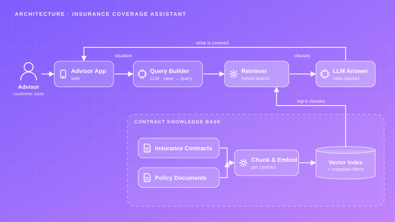
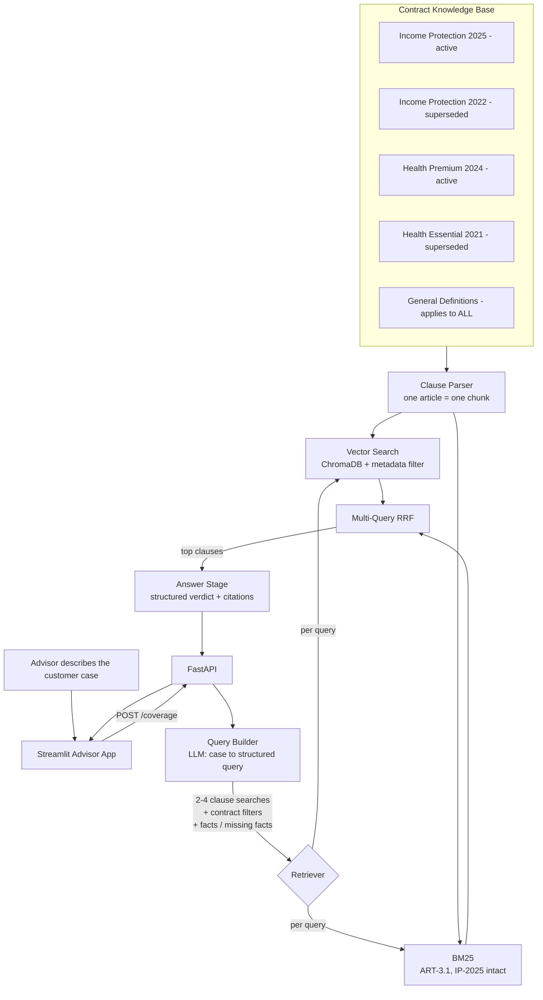

# Insurance — Coverage Assistant

An advisor describes a customer situation in plain language; the system decomposes it into clause-level searches across the right contract generation and returns a grounded verdict with the exact articles it rests on.

## Project Card

| Field | Value |
|-------|-------|
| Experiment ID | EXP-006 |
| Difficulty | Advanced |
| Build Time | ~8 Hours |
| Tech Stack | FastAPI, Streamlit, ChromaDB, BM25, OpenAI, Docker |
| Video | ⏳ |

## Overview

Insurance advisors talk to customers every day, and for each conversation they need to work out — precisely, per contract — what is actually covered. Before this tool that meant manually searching contracts and supporting documents for every case: customer case → search contracts → read documents → find the answer → call the customer back.

It was slow, and the more contract variations involved, the more room there was for a missed clause.

This experiment builds the assistant that removes the search step. The advisor types the situation as the customer described it; the system converts it into contract language, retrieves the applicable clauses from the applicable generation, and returns a verdict the advisor can say out loud — with the article references attached, so it can be checked in a glance.

The hard part is not retrieval. It is that a coverage answer is almost never one clause, and that the same article number says different things in different generations of the same product.

## Features

* **Query Decomposition:** An LLM stage converts the advisor's sentence into two to four distinct clause-level searches in contract register, because one query cannot find the benefit, the waiting period, the exclusion and the definition at once.
* **Clause-Level Retrieval:** The unit of retrieval is a whole numbered article, never a fixed-size window. An advisor has to be able to read the clause in full.
* **Generation-Aware Filtering:** Four contract generations across two product lines. Metadata filters scope retrieval, and cross-product definitions are exempted from every filter.
* **Refusal to Guess Between Generations:** If the case does not say which generation the customer is on and the generations disagree, the verdict is `insufficient_information` with the difference spelled out — never the more generous reading.
* **Structured Verdict:** Five-state verdict, headline sentence, cited explanation, conditions, and an explicit "what would change this answer" list.
* **Missing-Fact Detection:** The query builder records what the case does not state but the answer depends on, and that list is carried into the response.
* **Advisor Warnings:** Superseded wordings, caps the customer is about to hit, and common misreadings surface as a separate note.
* **Two Front Doors:** A REST API for CRM integration, and a Streamlit advisor app that shows every retrieved clause and the searches that found it.

## Architecture





### Stage 1 — Query Builder

The advisor types what they heard:

> "customer is on sick leave since February with a slipped disc, she has the 2022 prevoyance, when does she start getting paid"

Embedding that sentence retrieves clauses about sick leave in general. What the answer actually needs is three separate retrievals — the waiting period, the back-and-spinal limitation, and the definition of incapacity — all filtered to IP-2022. The query builder produces exactly that, plus the facts the case states and the facts it does not.

```json
{
  "coverage_question": "When does income protection indemnity begin for a member off work with a herniated disc?",
  "search_queries": [
    "waiting period before daily indemnity is payable for illness",
    "incapacity resulting from a back or spinal condition limitation",
    "definition of total incapacity for work",
    "claim notification deadline from the start of incapacity"
  ],
  "product_line": "income_protection",
  "contract_ids": ["IP-2022"],
  "facts": {
    "incapacity_start": "February",
    "condition": "herniated disc",
    "contract_generation": "2022"
  },
  "missing_facts": [
    "the exact first day of incapacity",
    "whether imaging confirms the lesion",
    "whether the cause was an accident or an illness"
  ]
}
```

### Stage 2 — Multi-Query Clause Retrieval

Each search query runs through both a vector search and BM25, and all the ranked lists are fused with Reciprocal Rank Fusion into one ordering. Running the queries independently and fusing at the end is what produces a clause set covering four different topics, instead of four near-duplicates of whichever clause matched the whole sentence best.

The metadata filter is a union, not an intersection:

```python
{"$or": [{"contract_id": {"$in": ["IP-2022"]}}, {"applies_to_all": True}]}
```

Without the second branch, filtering to a contract hides `GEN-DEF`, and a benefit expressed as "200% of the statutory tariff" loses its meaning — `ART-D.1` is the clause that says a 200% benefit means twice the tariff in total, not 200% added on top.

### Stage 3 — Grounded Verdict

| Verdict | When |
|---|---|
| `covered` | The clauses settle it in the customer's favour |
| `covered_with_conditions` | Covered subject to conditions the advisor must state |
| `not_covered` | An exclusion or limitation applies |
| `insufficient_information` | The answer hinges on a fact the case does not give, or on a generation it does not identify |
| `no_applicable_clause` | Nothing in the library addresses the situation — escalate |

### The Contract Library

95 clauses across five wordings, built to reproduce the real problem rather than a clean one:

| Contract | Product | Status | Clauses |
|---|---|---|---:|
| `IP-2025` | Income Protection | active | 22 |
| `IP-2022` | Income Protection | closed to new business | 16 |
| `HP-2024` | Health Premium | active | 24 |
| `HE-2021` | Health Essential | closed to new business | 20 |
| `GEN-DEF` | General Definitions | applies to **ALL** | 13 |

The two income protection generations are where the design is tested. `ART-6.2` exists in both:

> **IP-2025 ART-6.2** — Incapacity resulting from a psychological or psychiatric condition **is covered**, subject to a specific waiting period of 180 days and a maximum payment period of 365 days per claim…
>
> **IP-2022 ART-6.2** — Incapacity resulting from a psychological or psychiatric condition **is excluded** under this contract, without exception.

Same product, same article number, opposite answers. An assistant that retrieves "the" ART-6.2 and answers from it is wrong half the time, and confidently.

## Tech Stack

| Category | Technology |
|---|---|
| Language | Python 3.11+ |
| API | FastAPI, Uvicorn, Pydantic v2 |
| UI | Streamlit |
| Vector Store | ChromaDB (persistent, cosine, metadata filters) |
| Keyword Search | rank-bm25 |
| LLM | OpenAI `gpt-4o-mini` |
| Embeddings | `text-embedding-3-small` |
| Environment | Docker, docker-compose |
| Testing | pytest |

## Quick Start

### 1. Configure and Index

```bash
cp .env.example .env    # add OPENAI_API_KEY
pip install -r requirements.txt
python -m ingestion.ingest
```

```text
Indexing contract library from contracts ...
  indexed 64/95 clauses
  indexed 95/95 clauses
{
  "contracts": 5,
  "clauses": 95,
  "by_contract": {"HE-2021": 20, "HP-2024": 24, "IP-2022": 16, "IP-2025": 22, "GEN-DEF": 13}
}
```

### 2. Ask From the CLI

```bash
python -m rag.answer "Customer off work since 12 Feb with a slipped disc confirmed by MRI, 2025 income protection. When do payments start?"
```

### 3. Or Run the Full Stack

```bash
docker-compose up --build
# Advisor app:   http://localhost:8501
# API docs:      http://localhost:8000/docs
```

Locally, without Docker:

```bash
uvicorn api.main:app --reload          # terminal 1
streamlit run ui/app.py                # terminal 2
```

### 4. Run the Tests

```bash
pytest -q
```

Eight tests over clause splitting, frontmatter, namespacing and the generation divergence. No API key needed.

## Example

**Case entered by the advisor:**

> "Customer is off work with depression, signed off by her GP six weeks ago. She wants to know if she will be paid and for how long."

**Response:**

```json
{
  "verdict": "insufficient_information",
  "headline": "The answer depends entirely on which income protection generation she is on — the 2025 wording covers this, the 2022 wording excludes it.",
  "explanation": "Under the current wording, incapacity from a psychological condition is covered but with a 180-day waiting period and a 365-day maximum payment period per claim (IP-2025 ART-6.2). Under the previous generation it is excluded without exception (IP-2022 ART-6.2). At six weeks she is inside the waiting period under either reading, so no payment is due yet in either case (IP-2025 ART-3.1). The wording in force at the first day of incapacity is the one that applies, not the wording in force today (GEN-DEF ART-R.2).",
  "governing_clauses": [
    "IP-2025 ART-6.2", "IP-2022 ART-6.2", "IP-2025 ART-3.1", "GEN-DEF ART-R.2"
  ],
  "conditions": [
    "Under IP-2025, cover begins only from the 181st day of incapacity",
    "Under IP-2025, payment is capped at 365 days per claim unless hospitalisation exceeded 15 consecutive days"
  ],
  "what_would_change_the_answer": [
    "Which contract generation she is on",
    "The exact first day of incapacity",
    "Whether she was hospitalised for more than 15 consecutive days"
  ],
  "advisor_note": "Do not quote the 2025 terms until you have confirmed the generation on her schedule. IP-2022 is closed to new business but members who did not migrate are still on it."
}
```

The verdict is not a failure. The advisor now knows exactly which one question to ask, and knows not to promise anything before asking it. That is the outcome a careful human advisor would reach, and it is the one the system is designed to produce rather than avoid.

## Challenges

* **One query finds one topic.** The first version embedded the advisor's sentence directly. For the slipped-disc case it returned four clauses, all about incapacity in general, and none about the waiting period — so the answer was about whether she was covered rather than when she would be paid, which was the actual question. Decomposing into separate clause-level searches was the single biggest quality change in the build.
* **Metadata filters delete the definitions.** Scoping to `contract_id: IP-2022` is obviously correct and quietly removes `GEN-DEF`. Answers then explained a "200% of statutory tariff" benefit as 200% *added to* the statutory reimbursement, which is a real and common misreading and roughly doubles the number an advisor would quote. The `$or` with `applies_to_all` fixed it.
* **Article numbers collide across generations.** `ART-6.2` is a valid ID in four different wordings. The first index used the bare article as the Chroma document ID, so each contract silently overwrote the last and the library ended up with one generation's answers under everyone's name. Namespacing IDs as `IP-2025::ART-6.2` fixed it, and the test suite now asserts the two generations differ.
* **Short clauses do not embed.** "Not covered under this contract." is five words with no subject. It never surfaced for any query. Prefixing every clause with product, contract ID, version and heading before embedding made exclusion clauses retrievable — and exclusions are exactly the clauses an advisor most needs to not miss.
* **The model wanted to be helpful about missing facts.** Given clauses from two generations with different answers, early versions picked one — usually the more generous — and answered confidently. Making `insufficient_information` a first-class verdict, with an explicit instruction never to choose the more generous reading, was necessary; without it the system was worse than no system, because it was wrong in the direction that creates a promise to a customer.
* **The euro amount is a trap.** Asked "how much will she get", the model would multiply an insured amount by a rate and produce a figure. Every ingredient of that calculation lives in the member's schedule, not the wording. The prompt forbids computing amounts unless every figure appears in the retrieved clauses.

## Design Decisions

* **Why a separate query-building stage instead of one prompt?** The two jobs pull in opposite directions. Query building wants to expand and diverge — produce several different searches. Answering wants to converge and refuse — say only what the clauses support. Prompting one model to do both produced answers that hedged where they should have been definite and guessed where they should have hedged.
* **Why clause-level chunking with no overlap?** A contract is not prose, it is a numbered list of atomic obligations. An advisor quoting half of ART-4.2 to a customer is worse than an advisor who found nothing, because it looks authoritative. The cost is that short clauses embed poorly, and that is paid for with a context prefix rather than by merging clauses.
* **Why keep superseded wordings in the index?** Because members are still on them. A claim is judged under the wording in force at the date of the insured event (`GEN-DEF ART-R.2`), so a library containing only current products answers the wrong question for every legacy member — and legacy members are exactly the ones whose cases advisors find hard.
* **Why five verdicts instead of covered/not covered?** Because three of the five are the common cases. Real coverage questions are mostly conditional, mostly depend on a fact the customer has not mentioned, and occasionally fall outside the library entirely. A binary verdict forces all of that into a wrong answer.
* **Why return `what_would_change_the_answer` on every response?** It converts an incomplete answer into a next action. An advisor who reads "this depends on whether imaging confirmed the lesion" asks that question on the same call. An advisor who reads a confident wrong answer does not.
* **Why does the UI show every retrieved clause, not just the cited ones?** Because the failure mode that matters is a clause that should have been found and was not, and that is invisible if the interface only shows what the model used. Showing the full retrieval, marked with which searches found each clause, makes the gap visible to the person best placed to notice it.
* **Why Streamlit for the advisor app and FastAPI underneath?** The API is the real product — it goes into the CRM where advisors already work. Streamlit is how the logic gets demonstrated and inspected without building a front end, and keeping it a thin client over the same endpoint means the two can never drift apart.

## Lessons Learned

* Retrieval quality is mostly a query-construction problem. The retriever was competent from the start; what it was being asked to find was the problem, and fixing that needed a model, not a better index.
* A metadata filter is a decision about what to hide, and it will hide something you needed. Any filter over a document library needs an explicit exemption path for the cross-cutting documents — definitions, general conditions, regulatory annexes — that give the filtered documents their meaning.
* Namespace every identifier that comes from inside a document. Article numbers, section numbers and clause references are unique within a document and collide across a library, and the collision is silent.
* "I cannot answer this without knowing X" is a feature with a measurable value. In this domain the cost of a confident wrong answer is a promise made to a customer, so a system that refuses precisely is worth more than one that answers fluently.
* Showing the retrieval, not just the answer, is what makes a RAG system improvable. The most useful thing in the advisor UI is the list of clauses that were found and not used.
