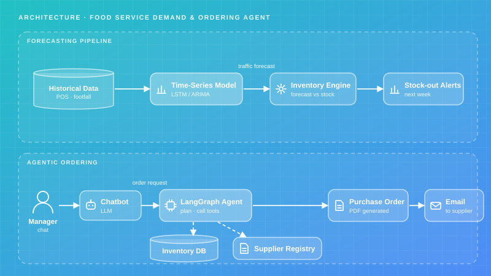
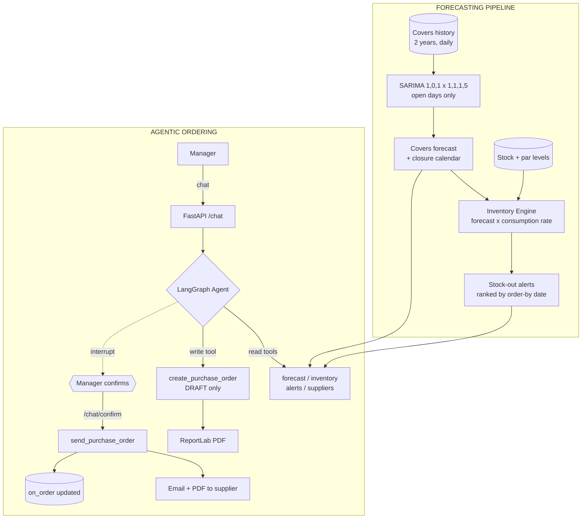

# Food Service — Demand & Ordering Agent

Covers forecasting linked to inventory so stock-outs are flagged a week ahead, plus a LangGraph agent that turns "order three cases of water" into a priced purchase order, a PDF and an email to the right supplier — with a confirmation step enforced in the graph.

## Project Card

| Field | Value |
|-------|-------|
| Experiment ID | EXP-007 |
| Difficulty | Advanced |
| Build Time | ~10 Hours |
| Tech Stack | LangGraph, SARIMA (statsmodels), FastAPI, SQLAlchemy, ReportLab |
| Video | ⏳ |

## Overview

A food service operator wanted an application that helps each restaurant manager with the day-to-day: knowing how many customers to expect, keeping stock under control, and not having to jump between screens or spreadsheets to answer a simple operational question or place a supplier order.

The application has two connected halves. A time-series model predicts expected customer traffic from historical data and links it to inventory levels, so the system can flag ahead of time that stock of a product will run short. A chatbot in the same app answers direct questions instead of making the manager navigate several screens — and on top of that, an agentic layer acts on a request like "order three cases of water": it identifies the product and quantity, finds the registered supplier, generates a purchase order, builds a PDF and emails it.

This experiment builds both halves and the join between them, which is the part that is actually hard.

## Features

* **Covers Forecasting:** SARIMA with a weekly seasonal period, benchmarked on a rolling-origin backtest against a seasonal-naive baseline it has to beat.
* **Closure-Aware Modelling:** Weekends, public holidays and the August shutdown are removed before fitting and put back by the calendar afterwards.
* **Stock Projection:** Forecast covers × per-product consumption rate, drained day by day against current stock and stock already on order.
* **Order-By Alerts:** Alerts key off the order-by date, not the stock-out date, and are filtered to an action window so the list is a worklist rather than the whole catalogue.
* **Shelf-Life-Capped Quantities:** Suggested order quantities never exceed what will be used within shelf life, so the fix for a bread shortage is not two weeks of stale bread.
* **Agentic Ordering:** A LangGraph ReAct agent with six tools, from traffic forecast to sending a purchase order.
* **Enforced Human-in-the-Loop:** The graph interrupts before `send_purchase_order`. Confirmation is a structural property of the graph, not an instruction in a prompt.
* **Real Documents:** ReportLab generates the purchase order PDF; delivery defaults to a dry run that writes an `.eml` to the outbox.

## Architecture





### The Forecast

A staff restaurant has a very specific traffic signature, and the seeded two years of history reproduces it: a strong weekday cycle, Tuesday to Thursday peak, a hard Friday dip from remote working, weekends and public holidays closed, an August shutdown, an annual cycle, and a slow upward trend as headcount grows.

Closed days are modelled outside the model. Feeding structural zeros into a seasonal model teaches it that covers oscillate to zero twice a week, which corrupts the weekday shape it exists to learn. The series is fitted on open days only, with a seasonal period of 5, and the calendar puts the zeros back.

Actual backtest output from the seeded data:

```text
Backtest (rolling origin, 10 open days per fold):
{'model_mape_pct': 8.15, 'baseline_mape_pct': 8.55, 'model_mae_covers': 38.9,
 'baseline_mae_covers': 40.8, 'folds': 6, 'beats_baseline': True}

Next 14 days:
  2026-09-19  closed (weekend)
  2026-09-20  closed (weekend)
  2026-09-21   388 covers [313-464]     <- Monday, quiet
  2026-09-22   574 covers [498-649]     <- Tuesday, peak
  2026-09-23   583 covers [508-658]
  2026-09-24   550 covers [474-625]
  2026-09-25   393 covers [318-468]     <- Friday, remote-working dip
```

The margin over the seasonal-naive baseline is real but narrow — 8.15% against 8.55% MAPE. That is worth reporting honestly, and it is why the baseline is in the codebase rather than in a footnote. In a business with a cycle this regular, "the same weekday last week" is a genuinely strong predictor, and a model that cannot beat it is not earning its dependency.

### The Join

This is where the forecast becomes operational:

```text
predicted covers  x  consumption_per_100_covers / 100  =  daily consumption
running stock - daily consumption, day by day          ->  stock-out date
stock-out date - lead_time_days                        ->  ORDER BY date
```

`consumption_per_100_covers` is an empirical rate per product, not a recipe calculation. It is the one number that connects a traffic model to a supplier order.

Actual alert output:

```text
7 product(s) must be ordered within the next 7 days:
  [    high] Baguette            out 2026-09-21 | order by 2026-09-20 |  11 cases =  121.00 EUR | Atlas Dry Goods
  [    high] Mixed salad leaves  out 2026-09-22 | order by 2026-09-21 | 136 cases =  707.20 EUR | Vallee Fresh Produce
  [    high] Chicken breast      out 2026-09-22 | order by 2026-09-20 |  48 cases = 2064.00 EUR | Cote Protein
  [  medium] Minced beef         out 2026-09-24 | order by 2026-09-22 |  25 cases = 1300.00 EUR | Cote Protein
  [  medium] Salmon fillet       out 2026-09-24 | order by 2026-09-21 |  12 cases =  859.20 EUR | Cote Protein
  [  medium] Potatoes            out 2026-09-25 | order by 2026-09-23 |  19 cases =  451.25 EUR | Vallee Fresh Produce
  [  medium] Still water 50cl    out 2026-09-28 | order by 2026-09-26 |  32 cases =  268.80 EUR | Nord Beverages
```

Seven alerts out of sixteen products. Getting to seven rather than sixteen took two fixes, both described under Challenges.

### The Agent's Tools

| Tool | Risk | What it does |
|---|---|---|
| `get_traffic_forecast` | read | Covers forecast for N days, closures included |
| `get_forecast_accuracy` | read | Backtest MAPE vs. baseline, for "how much should I trust this" |
| `check_inventory` | read | Stock on hand, par level, on order, per product or category |
| `list_stockout_alerts` | read | The worklist above |
| `find_supplier` | read | Registered supplier, cut-off time, delivery days |
| `create_purchase_order` | **write, local** | Prices the lines, builds the PDF, stores a **draft**. Sends nothing. |
| `send_purchase_order` | **write, external** | The only tool that leaves the building |

Splitting draft from send is what makes a confirmation step possible at all. If one tool did both, the agent would have committed before the manager saw the order.

## Tech Stack

| Category | Technology |
|---|---|
| Language | Python 3.11+ |
| Agent | LangGraph, LangChain, OpenAI `gpt-4o-mini` |
| Forecasting | statsmodels SARIMAX, numpy, pandas |
| API | FastAPI, Uvicorn, Pydantic v2 |
| Database | SQLite, SQLAlchemy 2.0 |
| Documents | ReportLab (PDF), `email.message` (SMTP) |
| Environment | Docker, python-dotenv |
| Testing | pytest |

## Quick Start

### 1. Configure and Seed

```bash
cp .env.example .env    # add OPENAI_API_KEY
pip install -r requirements.txt
python -m database.seed
```

```text
Seeding food service database ...
{"covers_rows_added": 730, "covers_rows_total": 730,
 "suppliers_added": 4, "products_added": 16}
```

### 2. Look at the Forecast and the Alerts

```bash
python -m forecasting.model       # backtest + 14-day forecast
python -m forecasting.inventory   # stock-out alerts with order-by dates
```

### 3. Run the API

```bash
docker-compose up --build
# Docs: http://localhost:8000/docs
```

```bash
curl -s localhost:8000/alerts | jq '.alert_count'
curl -s "localhost:8000/forecast?days=7" | jq
curl -s localhost:8000/forecast/accuracy | jq
```

### 4. Talk to the Agent

```bash
curl -s -X POST localhost:8000/chat \
  -H 'content-type: application/json' \
  -d '{"message":"what am I going to run short of this week?","thread_id":"m1"}' | jq -r .response

curl -s -X POST localhost:8000/chat \
  -H 'content-type: application/json' \
  -d '{"message":"order enough chicken to cover it","thread_id":"m1"}' | jq -r .response

# The agent drafts, then stops. Confirm explicitly:
curl -s -X POST localhost:8000/chat/confirm \
  -H 'content-type: application/json' -d '{"thread_id":"m1"}' | jq -r .response
```

The PDF and the dry-run `.eml` land in `outbox/`.

### 5. Run the Tests

```bash
pytest -q
```

Seven tests over the stock projection, the closure handling and the severity logic. No API key, no database.

## Example

**Manager:** *what am I going to run short of this week?*

> Seven items need ordering in the next seven days. The three urgent ones:
> - **Baguette** — out Monday 21st, order by **tomorrow** (1-day lead), 11 cases, ~121 EUR, Atlas Dry Goods
> - **Chicken breast** — out Tuesday 22nd, order by **tomorrow** (2-day lead), 48 cases, ~2,064 EUR, Cote Protein
> - **Mixed salad leaves** — out Tuesday 22nd, order by Monday, 136 kg, ~707 EUR, Vallee Fresh Produce
>
> Atlas and Cote both need the order tomorrow. Atlas cuts off at 12:00.

**Manager:** *order the chicken*

> Draft **PO-20260919-A3F81** to Cote Protein: 48 cases of chicken breast (240 kg), **2,064.00 EUR**. They deliver Tuesdays and Fridays, cut-off 14:00. PDF is ready. Confirm and I will send it.

The agent stops here. `/chat/confirm` is a separate endpoint:

**Manager confirms:**

> Dry run: purchase order written to `PO-20260919-A3F81.eml` instead of being emailed. Set `EMAIL_DRY_RUN=false` to send for real.

## Challenges

* **Structural zeros wrecked the seasonal model.** The first version fitted SARIMA on the raw daily series, weekends included. With two zeros in every seven observations the model learned a period-7 oscillation dominated by the closures, and its weekday shape was flat — Tuesday and Friday came back within a few covers of each other, when the real gap is about 180. Fitting on open days with a period of 5 and reapplying closures from the calendar fixed it.
* **The alert list flagged every product.** Over a 14-day horizon everything runs out, so "will run out within the horizon" returned all 16 products, which is the same as returning none. Two fixes were needed: realistic par levels by category (dry goods hold three weeks, salad holds three days) and — the important one — filtering on the **order-by date** inside an action window. "You must place this order in the next seven days" is a worklist; "you will eventually need more rice" is not.
* **A unit price that was sometimes a case price.** `unit_price_eur` was populated with per-bottle prices for some products and per-case prices for others, and the order total multiplied cases by it. An 11-case baguette order priced at 6.05 EUR instead of 121.00 EUR — wrong by exactly `units_per_case`, and entirely plausible-looking on a PDF. Renaming the column to `case_price_eur` and documenting it on the model was the fix; the bug existed because the name permitted both readings.
* **Ordering back to par produced absurd quantities for perishables.** Sizing an order from the deficit alone told the site to buy two weeks of baguettes with a one-day shelf life. The quantity is now capped by `daily_consumption × shelf_life_days`.
* **Stock already on order was double-ordered.** Without adding `on_order` to the opening balance, an alert raised on Monday stayed raised on Tuesday after the order was placed, and the agent ordered it again. This is now asserted in the test suite.
* **LangGraph interrupts before the whole tool node, not one tool.** `interrupt_before=["tools"]` stops the graph before every tool call, including harmless reads, which would mean confirming a stock lookup. The loop in `chat()` inspects the pending tool call: if it is `send_purchase_order` it returns for confirmation, and otherwise it resumes automatically. The cost is an extra state round trip per read; the benefit is that the confirmation gate lives in the graph rather than in a prompt the model can talk itself out of.

## Design Decisions

* **Why SARIMA rather than an LSTM?** The site has one daily series with 500 open-day observations and a dominant weekly cycle. That is exactly where classical seasonal models are strong and a sequence model has nothing to learn from. An LSTM here would add a training loop, a GPU-shaped dependency and a worse result. Where a fleet of sites shares structure, the answer changes — which is why EXP-009 uses both and picks per problem.
* **Why ship the seasonal-naive baseline in the codebase?** Because it is what the model has to justify itself against, and 8.15% vs 8.55% is a margin narrow enough that anyone deploying this deserves to see it. A forecasting project without a baseline is a project that cannot tell whether it worked.
* **Why does the alert report the order-by date rather than the stock-out date?** A manager told they will run out next Thursday, and not told the supplier needs three days, will still run out. The lead time is the part that makes the warning actionable, so it is in the headline rather than in a detail field.
* **Why is confirmation in the graph and not in the prompt?** A prompt instruction not to send without confirmation is a strong suggestion. A graph that cannot reach the send node without a separate resume call is a guarantee. For a tool that emails a supplier and commits spend, the difference matters, and the `/chat/confirm` endpoint exists precisely so that "ok" in a chat message cannot be read as authorisation.
* **Why does a dry run not mark the order as sent?** Because then the first real send would be refused as a duplicate. A dry run is a rehearsal, and rehearsals do not change state.
* **Why does `create_purchase_order` refuse a mixed-supplier order?** Purchase orders are per supplier in every system that will ever receive one. Letting the agent build a combined order would produce a document nobody can process, and the agent would have no reason to notice.
* **Why give the agent a tool that reports forecast accuracy?** Because the manager will ask, and the honest answer is a number. Without the tool the model invents reassurance, which is the worst possible answer to "can I trust this".
* **Why keep the covers history synthetic rather than random?** A forecasting experiment on noise is a test of nothing. The generator encodes weekday shape, annual seasonality, trend, closures and occasional one-off events, so the model is being asked to recover structure that is genuinely there — and the tests assert the structure exists.

## Lessons Learned

* Most of the value in a forecasting project is in the join, not the model. "512 covers on Thursday" is trivia; "order chicken by tomorrow or you are short on Tuesday" is the product, and it came from a multiplication and a subtraction sitting on top of the forecast.
* An alert that fires on everything is identical to an alert that fires on nothing. Threshold design deserves as much attention as model selection, and the right threshold is usually about when someone must act rather than about when something goes wrong.
* Column names are a correctness concern. `unit_price_eur` let two different meanings coexist in one field for the whole build, and the resulting error was off by a clean integer factor — the kind that looks like a plausible number rather than a bug.
* Guardrails belong in the structure, not the instructions. Moving the ordering confirmation from the system prompt into a graph interrupt changed it from a behaviour to a property.
* Handle the calendar before handing data to a seasonal model. Closures, holidays and shutdowns are not noise to be smoothed, and leaving them in the series corrupts precisely the pattern the model was hired to learn.
