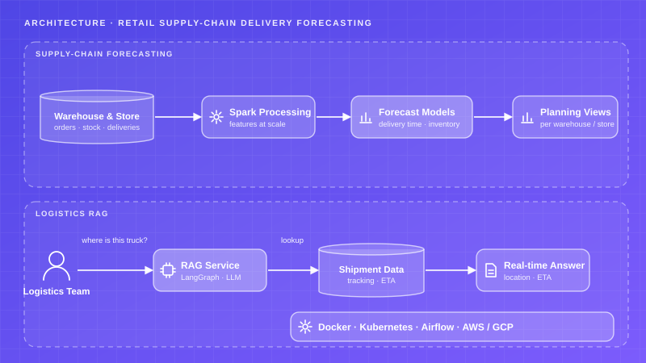
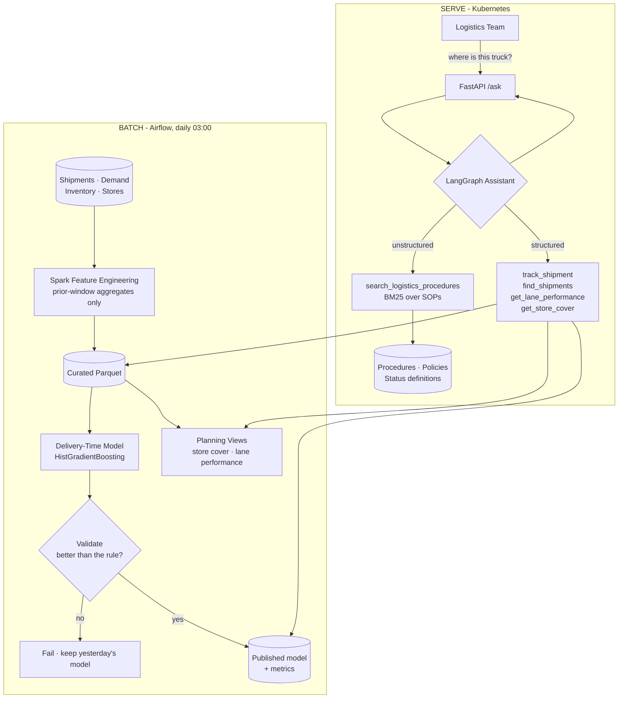

# Retail Supply Chain — Delivery Forecasting & Logistics RAG

Delivery-time and inventory forecasting across a network of warehouses and stores, plus a natural-language logistics assistant that answers "where is this delivery" from live shipment data and tells you what the escalation procedure says to do about it — on a stack built to be deployed: Spark, Airflow, Docker, Kubernetes.

## Project Card

| Field | Value |
|-------|-------|
| Experiment ID | EXP-008 |
| Difficulty | Advanced |
| Build Time | ~12 Hours |
| Tech Stack | PySpark, scikit-learn, Airflow, LangGraph, FastAPI, Docker, Kubernetes |
| Video | ⏳ |

## Overview

A large retailer's logistics and supply chain span a network of warehouses and stores across several countries. Predicting delivery times and inventory needs at that scale is hard, and when a logistics team needs to know where a specific truck or delivery actually is right now, digging through systems manually is too slow to be useful.

Two connected efforts, both built with a strong emphasis on production deployment:

**Forecasting at scale** — models predicting delivery times and inventory levels across warehouses and stores in different regions, feeding planning decisions upstream.

**Logistics RAG** — a retrieval tool that lets logistics teams ask natural-language questions and get a real-time answer instead of searching several systems by hand.

Because the emphasis was on reliable deployment, the pipelines are built around a standard production stack: Spark for feature engineering at scale, Airflow for orchestration with a validation gate, Docker and Kubernetes for deployment, and object storage for the curated layer.

## Features

* **Leakage-Free Features:** Every historical aggregate is computed over a strictly prior window. Tested by asserting that truncating the dataset does not change the surviving rows' features.
* **Dual Engine:** The same features in PySpark and pandas, selected at runtime, with a parity test that asserts they produce identical output.
* **Honest Evaluation:** Chronological train/test split, benchmarked against both the existing planning rule and a lane-median baseline.
* **Late Recall, Not Just MAE:** Measures whether the model flags the shipments that will actually miss their promise — the metric the operation cares about.
* **Store Cover Planning:** 21-day demand forecast joined to on-hand and in-transit stock, producing days of cover and projected stock-out dates per store and category.
* **Volume-Gated Lane Ranking:** A lane needs 20 shipments in 90 days before its on-time rate is treated as a measurement.
* **Structured + Unstructured Retrieval:** Live shipment lookups and procedure search as separate tools, because "where is this truck" and "what do I do about it" are different questions.
* **Airflow Gate:** The DAG refuses to publish a model that is not meaningfully better than the rule it replaces, or that has regressed against production.
* **Kubernetes Manifests:** Deployment with HPA, readiness probes that check for curated artifacts rather than just process liveness, and a pipeline CronJob.

## Architecture





### The Feature Layer, and the Leak It Avoids

The most useful features for predicting transit time are historical: this carrier's recent average, this lane's median, this warehouse's throughput. They are also the easiest place in the whole pipeline to destroy a model silently.

Computing a carrier's average transit time over the whole dataset and joining it onto every row puts the future into the past. Training rows carry information from shipments that had not happened yet, the offline metric looks excellent, and the model degrades the moment it sees live traffic — at which point the metric that justified deploying it is the reason nobody believes the degradation.

Every aggregate here is a shifted expanding window. In pandas:

```python
grouped.transform(lambda series: series.shift(1).expanding().mean())
```

and in Spark:

```python
Window.partitionBy("carrier").orderBy("dispatch_date", "shipment_id") \
      .rowsBetween(Window.unboundedPreceding, -1)
```

Rows in the first 60 days have no usable history. They are **flagged and excluded**, never filled with a global mean — filling them would put a future-aware quantity into the earliest rows, which is the same leak wearing a different hat.

The test that pins this down is the strongest one in the repo: build features on 60 rows, build them again on the first 30, and assert the 30 surviving rows are byte-identical. If anything looked forward, removing later rows would move the numbers.

### Spark or pandas

The production pipeline runs on Spark because the real shipment table needs it. Spark needs a JVM, which would make this experiment unrunnable for anyone who just wants to read the code, so both engines exist and the runtime picks:

```python
def spark_available() -> bool:
    if os.getenv("FORCE_PANDAS"): return False
    try: import pyspark
    except ImportError: return False
    return bool(os.getenv("JAVA_HOME") or os.getenv("SPARK_HOME"))
```

A dual implementation nobody checks is two implementations that have already diverged, so `test_features.py` runs both on the same input and asserts equality. That test skips where there is no JVM — which is honest, and is also why the Docker image ships a JRE.

### Model Results

Actual output from the seeded dataset, chronological split:

| | MAE (days) | RMSE | Within ½ day | Late recall |
|---|---:|---:|---:|---:|
| **Delivery-time model** | **0.162** | 0.378 | 94.5% | **90.4%** |
| Lane historical median | 0.374 | 0.626 | 73.6% | 26.4% |
| Existing planning rule | 0.531 | 0.650 | 43.1% | 0.0% |

Train: 2025-05-27 → 2026-05-29 (37,186 shipments). Test: 2026-05-29 → 2026-09-18 (10,489 shipments). The model is 69.5% better than the planning rule on MAE.

The late-recall column is the one that matters operationally. The planning rule scores 0% by construction — it *is* the promise, so it can never predict a miss against itself. The model catches 90% of the shipments that will arrive late, which is the difference between a team reacting to lateness and a team being warned about it.

Permutation importance, in order: `dispatch_dow`, `distance_km`, `planned_transit_days`, `lane_hist_median_transit`, `service_level_factor`, `warehouse_load`, `carrier_hist_mean_transit`, `carrier_hist_late_rate`. Day of week leads because weekend dispatch is genuinely expensive in the generated world — and that is the point of generating data with structure in it rather than noise.

### The Lane Ranking

The first version of "worst-performing lanes" looked like this:

```text
WH-BCN->ST-0402  CAR-NOR   1 shipment   0.0% on time
WH-BCN->ST-0403  CAR-EUR   1 shipment   0.0% on time
WH-KRK->ST-0104  CAR-EUR   1 shipment   0.0% on time
```

Every entry was a one-off cross-dock that ran once and ran late. Technically correct, operationally worthless. With a 20-shipment floor:

```text
WH-LYO->ST-0104  CAR-EUR  87 shipments  21.8% on time  p90 2.66 days
WH-LIL->ST-0204  CAR-EUR  86 shipments  24.4% on time  p90 2.53 days
WH-LYO->ST-0105  CAR-EUR  76 shipments  35.5% on time  p90 2.17 days
```

EuroLink dominates the bottom of the table — which is exactly the degradation the generator encodes into that carrier over the period. A finding, rather than a list.

## Tech Stack

| Category | Technology |
|---|---|
| Language | Python 3.11+ |
| Large-scale processing | PySpark (with a pandas fallback engine) |
| ML | scikit-learn `HistGradientBoostingRegressor`, permutation importance |
| Orchestration | Apache Airflow (TaskFlow API) |
| Agent | LangGraph, LangChain, OpenAI `gpt-4o-mini` |
| Document retrieval | rank-bm25 over section-split Markdown |
| Storage | Parquet (pyarrow) — object storage in production |
| API | FastAPI, Uvicorn |
| Deployment | Docker, Kubernetes (Deployment, HPA, CronJob, PVC) |
| Testing | pytest |

## Quick Start

### 1. Install and Build

```bash
cp .env.example .env    # add OPENAI_API_KEY
pip install -r requirements.txt

python -m data.generate              # 53k shipments, 240 live, 54k demand rows
python -m pipeline.features          # leakage-free features -> curated Parquet
python -m pipeline.planning_views    # store cover + lane performance
python -m pipeline.train_delivery_model
```

```text
Generating supply chain dataset ...
{"shipments": 53275, "live_shipments": 240, "store_demand": 54000, ...}

Building shipment features with the pandas engine ...
  53,275 rows, 47,675 usable after the 60-day warm-up

Model MAE 0.162 days vs planning rule 0.531 days (69.5% better)
```

To force the Spark engine, install `pyspark` and set `JAVA_HOME`.

### 2. Ask the Assistant

```bash
python -m rag.agent "what is late into the Spanish stores right now?"
python -m rag.doc_index "when can I claim against a carrier"
```

### 3. Run the API

```bash
docker-compose up --build
# Docs: http://localhost:8000/docs
```

```bash
curl -s localhost:8000/health | jq
curl -s localhost:8000/model/metrics | jq .model
curl -s "localhost:8000/lanes?worst=true" | jq '.lanes[:3]'
curl -s "localhost:8000/cover?store_or_region=FR-North" | jq
curl -s -X POST localhost:8000/ask -H 'content-type: application/json' \
  -d '{"question":"where is SHP-0053300 and is it going to be late?"}' | jq -r .answer
```

### 4. Deploy

```bash
kubectl apply -f deploy/k8s/pipeline-cronjob.yaml
kubectl apply -f deploy/k8s/api-deployment.yaml
```

The Airflow DAG lives in [`airflow/dags/supply_chain_dag.py`](./airflow/dags/supply_chain_dag.py).

### 5. Run the Tests

```bash
pytest -q
```

Six leakage and correctness tests, plus a Spark/pandas parity test that skips without a JVM.

## Example

**Question:** *where is SHP-0053300 and is it going to be late?*

The assistant calls `track_shipment`, sees a projected miss, then calls `search_logistics_procedures` for the escalation rule:

> **SHP-0053300** — Lyon DC → Toulouse (ST-0104), carrier EuroLink, standard service, 322 units.
>
> Last scan 6.2 hours ago at a line-haul hub, 71% through expected transit.
>
> - **Promised:** 2026-09-20 14:30 (this is what the store was told)
> - **Predicted arrival:** 2026-09-21 19:10, from the delivery-time model
> - **Projected delay:** ~28.7 hours
>
> That is **Tier 2**: 24–72 hours against promise. The regional planner contacts the carrier account manager, same day. Before escalating, check whether this lane already has an open incident — WH-LYO→ST-0104 with EuroLink is running at 21.8% on time over the last 90 days, so it may be covered by a lane review rather than a per-shipment escalation.
>
> The predicted arrival is a forecast, not a commitment — report against the promised date.

Three separate systems' worth of answer, in one reply: live tracking, the model's projection, lane performance and the procedure that says who acts.

## Challenges

* **Target leakage was invisible until it was tested.** The first feature build computed carrier and lane aggregates over the full dataset. Test MAE came out around 0.05 days, which looked like a triumph and was actually the model reading the answer. Nothing errored, nothing warned. Only the truncation test — same features, shorter dataset, assert the survivors are unchanged — makes that class of bug fail loudly.
* **Random splits flatter shipment models.** A random train/test split puts shipments from the same week on both sides. The model then knows how that week went, and every temporal effect — peak season, weather, carrier drift — becomes free information. The chronological split dropped the apparent score and is the only arrangement that resembles how the model is used.
* **MAE hid the metric that mattered.** An early model had a respectable MAE while catching under half the shipments that actually missed their promise, because it was optimising the easy middle of the distribution. Adding late recall alongside MAE changed both the model selection and the conversation about whether it was worth deploying.
* **The lane ranking was statistically true and operationally useless.** 0% on-time from one shipment outranked a lane failing 78% of the time across 87 shipments. A volume floor fixed it, and the floor is now also written into the escalation procedure document so the rule and the data agree.
* **Permutation importance was reported with the wrong sign.** With `scoring="neg_mean_absolute_error"`, `importances_mean` is already *MAE when shuffled minus baseline MAE*, so negating it reported every feature as actively harmful. The output was self-consistent and completely backwards — the kind of bug that survives review because the numbers look like numbers.
* **Predicting a live shipment needs training-time encoders.** Scoring a live shipment requires the same ordinal encoding the model was trained with, and the encoder was not in the artifact. The current code passes the documented unknown-category value and falls back to lane history when anything fails. A production system persists the encoder in the bundle; that is a real, named limitation here rather than something quietly working by accident.

## Design Decisions

* **Why gradient boosting rather than a deep model?** The signal is tabular and interactions are shallow — distance times carrier times calendar. Gradient boosting handles mixed types and missing values natively, trains in seconds, and gives permutation importance that a planner can argue with. A neural model would cost more in every dimension that matters here and return nothing.
* **Why ship two baselines?** The planning rule is what the model must beat to be worth deploying, and the lane median is what a competent analyst with a spreadsheet would produce. A model that beats neither should not ship, and a project that does not measure both cannot tell.
* **Why BM25 for the documents when EXP-004 and EXP-006 use vectors?** Three controlled documents, a few dozen sections, updated twice a year, queried with the vocabulary the documents are written in. An in-memory BM25 index answers in under a millisecond with no vector store, no embedding cost and no ingestion step in the DAG. Reaching for a vector database at this size is a habit, not a decision — and the parts that actually drive retrieval quality, section splitting and heading trails, are identical either way.
* **Why separate structured and unstructured tools instead of one "search"?** "Where is this truck" has an answer in a table and no answer in any document. Forcing it through document retrieval is how RAG systems end up confidently quoting a procedure at someone who asked a factual question. Most real questions need both, and the agent composes them.
* **Why does the DAG gate on model quality?** Because a pipeline that publishes whatever it produced will eventually publish something broken at 03:00 and tell nobody. The gate refuses a model less than 15% better than the planning rule, or more than 10% worse than the model in production, and failing the task leaves yesterday's model serving.
* **Why does training run twice in the DAG?** `train_model` evaluates with `save=False`; `publish` retrains with `save=True` only after the gate passes. That costs a few CPU-minutes and guarantees the artifact on disk is exactly the one that was validated, rather than one that merely resembles it.
* **Why does the readiness probe check for Parquet files?** A pod that is up but has no curated data cannot answer anything. A liveness probe that only proves the process is running will happily route traffic to it.
* **Why is the assistant read-only?** Nothing here needs a write, so there is no confirmation gate and no checkpointer — unlike EXP-007, where the agent commits spend. Matching the guardrails to the blast radius is the decision; adding a confirmation step to a stock lookup would be theatre.

## Lessons Learned

* Leakage is the defining risk of feature engineering on time-series data, and it is not caught by review — it is caught by a test that asserts the past does not change when you delete the future. That test is the single highest-value thing in this experiment.
* Pick the metric the operation would pick. MAE is the metric a modeller reaches for; "did we warn them in time" is the metric a logistics team is actually running on, and the two select different models.
* A statistic without a volume floor is an anecdote with a percentage sign. Every ranking over grouped data needs a minimum sample size before it is shown to anyone who will act on it.
* Build the escape hatch for the heavy dependency. The dual Spark/pandas engine cost an afternoon and a parity test, and it is why this pipeline runs unmodified on a laptop and on a cluster.
* State the limitation rather than letting it pass. The missing training-time encoder in the live scoring path is documented in the code and in this README, because a known gap someone can fix is worth more than a silent fallback that looks like it works.
