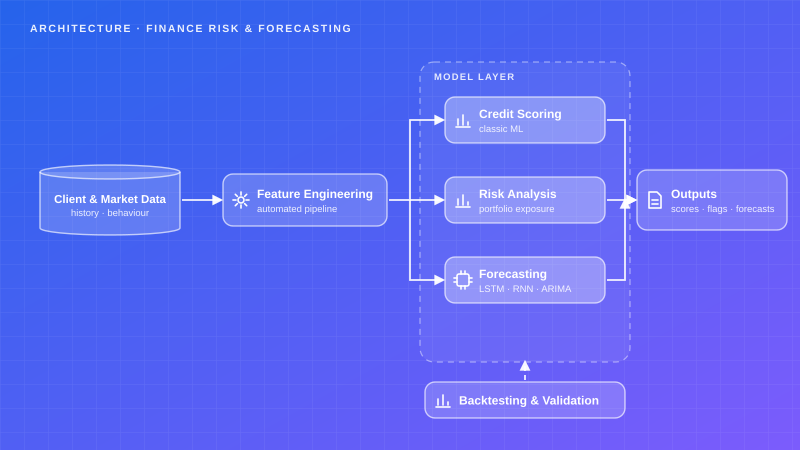
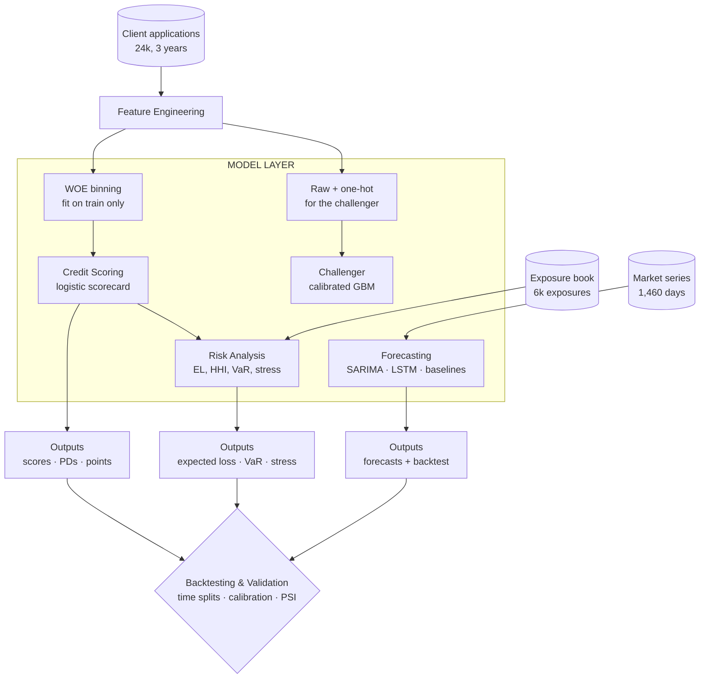

# Finance — Credit Scoring, Risk & Time-Series Forecasting

A WOE scorecard that a credit officer can explain, expected loss and VaR computed from its calibrated probabilities, an honest SARIMA-vs-LSTM comparison against baselines that both must beat, and a validation layer that catches the population drifting out from under all of it.

## Project Card

| Field | Value |
|-------|-------|
| Experiment ID | EXP-009 |
| Difficulty | Advanced |
| Build Time | ~10 Hours |
| Tech Stack | scikit-learn, statsmodels, PyTorch, pandas, scipy |
| Video | ⏳ |

## Overview

Finance clients regularly need to answer questions that are hard to get right with simple heuristics: who is a credit risk, how exposed is a portfolio, and what is likely to happen to a metric next month or next quarter. These are exactly the problems where a rule of thumb breaks down once the data gets noisy, seasonal, or large enough to need real statistical grounding.

This experiment covers the three of them as one pipeline, because in practice they are one pipeline. The scoring model produces probabilities; the risk layer turns those probabilities into euros; the forecasting layer projects the portfolio forward; and the validation layer is what tells you whether any of it still applies.

The method choices follow the brief: classic ML and time-series methods, LSTM and RNN-based sequence models alongside ARIMA/ARMA-family statistical ones, chosen per problem depending on data volume, seasonality and interpretability requirements. That is only a real choice if both are implemented and measured the same way, so both are here and the backtest decides.

This closely mirrors the credit-scoring and fraud-detection work built earlier at a brokerage, applied here to new client data and forecasting horizons. There is no LLM in this experiment — it is the statistical layer the agentic experiments in this lab sit on top of.

## Features

* **WOE Scorecard:** Monotonic binning plus Weight of Evidence, so a logistic regression can represent a non-monotonic relationship and stay readable. Laplace-smoothed, so a clean bin does not produce infinite points.
* **Calibration, Not Just Ranking:** Brier score and a decile predicted-vs-observed table, because the risk layer multiplies these probabilities by euros.
* **Challenger Model:** A calibrated gradient-boosting model quantifying exactly what the interpretability constraint costs in Gini.
* **Per-Decision Explanations:** Each applicant's score decomposed into WOE × coefficient contributions — the actual arithmetic the model used, not a post-hoc approximation.
* **Sign-Reversal Detection:** A coefficient implying that better applicants default more is flagged, not shipped.
* **Expected Loss & Concentration:** PD × LGD × EAD per exposure, with Herfindahl concentration and risk-intensity by sector, region and segment.
* **VaR Two Ways:** Historical and parametric side by side, plus expected shortfall, so the normal assumption's understatement is visible rather than implied.
* **Stress Testing:** Downturn multipliers and a sector shock that raises LGD as well as PD.
* **SARIMA vs LSTM vs Baselines:** Rolling-origin backtest against naive, drift and seasonal-naive, with SARIMA convergence reported per fold.
* **Population Stability:** Score-level and feature-level PSI, with reference bins fixed so drift cannot be absorbed by re-binning.

## Architecture





### Credit Scoring

Actual output on the held-out period (chronological split, 18,000 train / 6,000 test):

| | AUC | Gini | KS | Brier |
|---|---:|---:|---:|---:|
| **Scorecard (WOE + logistic)** | 0.766 | 0.532 | 0.410 | 0.0898 |
| Challenger (calibrated GBM) | 0.768 | 0.535 | 0.401 | 0.0873 |

**The cost of interpretability is +0.0025 Gini.** Essentially nothing.

That is the most useful number in this experiment. The usual assumption is that a scorecard gives up meaningful discrimination to a booster, and on this data it does not — because the binning has already absorbed the non-linearity the tree model would otherwise have to discover. The generator deliberately includes a U-shaped age effect (`0.00055 × (age − 45)²`) that a linear-in-age model cannot represent at all; the WOE bins handle it, and once they do, the booster has very little left to add.

Calibration by decile, which is what makes the expected loss downstream trustworthy:

```text
decile   n=600   predicted  observed   diff
     2       -       6.48%     7.00%  +0.52pp
     5       -      12.35%    15.50%  +3.15pp
     7       -      21.26%    24.00%  +2.74pp
     9       -      53.00%    54.50%  +1.50pp
```

The model under-predicts in the middle deciles by 2–3 percentage points. That is a real, visible bias, and it is visible because the table exists — the AUC would never have shown it.

### Risk Analysis

```text
Portfolio: 1,479 exposures, EUR 74,012,815
  Expected loss      EUR 5,004,403  (6.76% of exposure)
  1-day 99% VaR      EUR 5,913,898 historical
                     EUR 4,925,646 parametric normal  (understates by 20.1%)
  Expected shortfall EUR 7,885,291
  Sector HHI 0.180 (moderately concentrated, effectively 5.6 sectors)

  retail_trade   25.6% of exposure,  28.8% of loss,  intensity 1.12
  construction   25.3% of exposure,  25.1% of loss,  intensity 0.99
  services       11.4% of exposure,   8.7% of loss,  intensity 0.76

Stress tests
  mild_downturn                  EUR  7,005,198   +40.0%
  severe_downturn                EUR 10,493,220  +109.7%
  sector_shock_construction      EUR  8,456,492   +69.0%
```

The normal assumption understates the 99% VaR by 20%, and that is not a quirk of the synthetic data — it is what fat tails do. The return series has excess kurtosis of 6.4 and Jarque-Bera rejects normality outright, so the parametric figure is reported purely so the gap is legible. Risk intensity (loss share ÷ exposure share) is the column worth reading: retail trade is 25.6% of the book and 28.8% of the loss.

### Forecasting

Rolling-origin backtest, 6 folds, 14-day horizon, 1,460 observations:

| model | MAE (EUR) | MAPE % | Directional % |
|---|---:|---:|---:|
| **lstm** | 4,560,636 | **2.717** | 57.1 |
| sarima (0,1,1)(1,0,1,7) | 4,664,910 | 2.776 | 53.6 |
| naive | 4,673,697 | 2.782 | n/a |
| drift | 4,755,584 | 2.825 | 39.3 |
| seasonal_naive | 5,151,801 | 3.076 | 52.8 |

SARIMA converged on 6/6 fits. The LSTM wins, and it wins by 2.3% relative MAPE over doing nothing at all.

**That is the honest result, and it is the point.** On a series this close to a random walk, neither method buys much. Both beat naive; neither beats it by an amount that would survive a change of seed. The directional accuracy column is where the difference is real — 57% against a coin flip — and that is the metric that would actually justify either model in production.

One thing worth recording: the first version of this comparison ran SARIMA with a `(2,1,2)(1,0,1,7)` order and reported MAPE 3.195%, **worse than naive**. The conclusion "ARIMA does not work here" would have been wrong. The order converged in only 2 of 6 folds; the optimiser was losing, not the method. With a parsimonious `(0,1,1)` it converges everywhere and ties naive. The module now reports convergence counts alongside accuracy for exactly this reason.

### Validation

```text
Reference : 2023-09-21 to 2025-11-28
Current   : 2025-11-28 to 2026-08-20

Score PSI : 0.062  (stable)
Median score 554 -> 547  (-7 points)
Observed default rate 13.99% -> 17.63%

Feature drift
  debt_to_income      PSI 0.35503   <-- unstable
  bureau_score        PSI 0.08354       stable
  employment_years    PSI 0.00295       stable
```

This is the most instructive output in the experiment. The **score** PSI is 0.062, comfortably inside the stable band. The median score moved seven points. Anyone monitoring score stability alone would report no issue.

Meanwhile `debt_to_income` has a PSI of 0.355 — well past the unstable threshold — and the actual default rate has risen by 3.6 percentage points. The underwriting population has genuinely changed, the model is under-predicting as a result, and the aggregate score distribution absorbed it almost invisibly because the score is a weighted blend and the other features held still.

Score-level PSI alone would have missed this. That is why both are reported.

## Tech Stack

| Category | Technology |
|---|---|
| Language | Python 3.11+ |
| Credit scoring | scikit-learn (`LogisticRegression`, `HistGradientBoostingClassifier`, `CalibratedClassifierCV`) |
| Time series | statsmodels SARIMAX |
| Sequence model | PyTorch LSTM (optional) |
| Statistics | scipy (Jarque-Bera, kurtosis, normal quantiles) |
| Data | pandas, numpy, Parquet |
| Testing | pytest |

## Quick Start

### 1. Install and Run

```bash
pip install -r requirements.txt
# Optional, for the LSTM comparison:
pip install torch

python main.py all
```

Or step by step:

```bash
python main.py generate                # 24k applicants, 6k exposures, 1,460 market days
python main.py score                   # scorecard vs challenger
python main.py risk                    # expected loss, HHI, VaR, stress tests
python main.py forecast                # SARIMA vs LSTM vs baselines
python main.py validate                # PSI, score and feature drift
python main.py explain APP-000042      # why one applicant got their score
```

Every report is written to `outputs/` as JSON next to the model artifacts.

### 2. Run the Tests

```bash
pytest -q
```

25 tests. Scorecard scaling anchors, KS on known distributions, WOE monotonicity and smoothing, unseen-category handling, chronological splitting, Herfindahl bounds, stress-test arithmetic, PSI behaviour and the forecasting baselines. No generated data needed.

> **On Windows with Anaconda**, importing PyTorch alongside MKL-linked numpy can raise `OMP: Error #15`. It is an environment conflict, not a code issue; `KMP_DUPLICATE_LIB_OK=TRUE` is the usual workaround, or skip `torch` and the backtest will run SARIMA and the baselines and say the LSTM was not evaluated.

## Example

```bash
python main.py explain APP-000042
```

```text
APP-000042
  Score                   593 points
  Probability of default  2.48%
  Actual outcome          performed

  Largest contributions to risk:
    purpose                        working_capital              +0.0442
    months_since_last_delinquency  (-inf, 0.0]                  +0.0081
    annual_income                  (31599.333, 39940.0]         -0.0250
    loan_amount                    (18033.667, 31806.667]       -0.0484
    region                         central                      -0.0614
```

Each line is a bin, and a contribution that is literally WOE × coefficient. Positive pushes toward default, negative away from it. A credit officer declining an application can read the top line out loud, and an auditor can reproduce the total by hand.

## Challenges

* **AUC hid a calibration bias that mattered in euros.** The first version reported AUC and Gini and stopped. Discrimination was fine, and the model was under-predicting default probability by 2–3 percentage points across the middle deciles. Since the risk layer computes expected loss as PD × LGD × EAD, that bias propagated straight into the euro figure — roughly a 20% understatement of expected loss with nothing in the metrics to indicate it. Brier score and the decile table exist because of this.
* **A clean bin produced an infinite score.** A bureau-score bin with zero defaults gives a WOE of +infinity, which the scorecard converts into infinite points for anyone who lands in it. It does not error; the applicant is simply approved with certainty. Laplace smoothing on both the numerator and denominator fixed it, and the test suite now forces a clean bin and asserts finiteness.
* **A non-converged fit looked like a failed method.** SARIMA with a `(2,1,2)(1,0,1,7)` order scored worse than the naive baseline, which reads as "ARIMA does not suit this series". It converged in 2 of 6 folds. Parsimony fixed the accuracy, and reporting convergence alongside accuracy fixed the diagnosis — the conclusion was about to be drawn from an optimiser failure.
* **Naive appeared to be wrong 100% of the time on direction.** Directional accuracy compared `sign(predicted − last)` against `sign(actual − last)`. A flat forecast has sign zero, never matches, and the naive baseline was reported at 0.0% — which reads as "always wrong" when the truth is "never makes a call". Steps with no directional call are now excluded and the metric reports `n/a`.
* **The GARCH recursion was explosive and it looked like it worked.** The synthetic return generator used `vol = ω + 0.80·vol + 0.34·|shock|`. Because `0.80 + 0.34·E|z| ≈ 1.07 > 1`, volatility diverged and simply pinned to its upper clip: 135% annualised volatility, a portfolio falling from 249M to 5,785, and — most misleadingly — *near-normal* returns, because a series stuck at maximum volatility is homoscedastic. The VaR comparison showed a 4.7% gap and no fat tails. Setting `β + α·E|z| = 0.97` gave 19.4% annualised volatility, excess kurtosis of 6.4, and a 20% parametric understatement.
* **Pickling a dataclass from `__main__` broke every other entry point.** Saving the scorecard with `joblib.dump` recorded the class as `__main__.ScorecardModel` because the training module was run with `python -m`. The validation module then could not load it. The artifact now stores bin edges, WOE maps and coefficients as plain data, with a `load_scorecard()` that rebuilds the object — which also means the artifact survives a refactor of the class.
* **A test that tested pandas.** One test asserted that multiplying three pandas columns produced the expected product. It failed on floating-point (`2000.0000000000005`), and the correct fix was to delete it: it exercised no project code. It was replaced with four tests over the stress-test logic, including that the sector shock raises LGD as well as PD.

## Design Decisions

* **Why a WOE scorecard when a booster is easier?** Because the requirement was explainability, and a scorecard is explainable in a specific, strong sense: the score is a sum of bin contributions, so the reason for a decline is arithmetic rather than attribution. The experiment measures the cost of that choice rather than assuming it, and on this data the cost is 0.0025 Gini.
* **Why is the challenger calibrated?** Gradient boosting ranks well and is poorly calibrated out of the box. Comparing a calibrated scorecard against an uncalibrated booster on Brier score would flatter the scorecard for the wrong reason. Isotonic calibration makes the comparison like for like.
* **Why fit the bins on the training split only?** Bin edges drawn from the full dataset use the outcomes the model is about to be scored on. The leak is small and entirely invisible in the metrics, which is what makes it worth a deliberate guard.
* **Why chronological splits everywhere?** Credit portfolios drift — and in this data they drift by design. A random split scores the model on a population it has already seen, which is not the population it will meet. The drift the validation layer detects is only detectable because the split respects time.
* **Why report VaR two ways?** Because the parametric number is the one people quote and the historical number is the one that is right. Showing both, with the kurtosis and the Jarque-Bera result beside them, turns "we use VaR" into a statement someone can check. Expected shortfall is there because VaR by construction says nothing about how bad the bad days are.
* **Why does the sector shock raise LGD too?** Because collateral is worth less precisely when it is being realised. A stress test that moves only PD understates the loss in the scenario it is supposed to be modelling, and does so in the reassuring direction.
* **Why SARIMA and an LSTM rather than picking one?** The brief was to choose per problem based on data volume, seasonality and interpretability. That is only a choice if both are measured. The answer on this series — both marginally beat naive, the LSTM slightly ahead, neither decisively — is more useful than a confident recommendation would have been.
* **Why train the LSTM on log returns rather than levels?** Handing a network a non-stationary price series and asking for the next price teaches it to copy the last value. It converges nicely, the loss looks excellent, and it has learned the naive baseline with extra steps.
* **Why does the PSI reference binning come only from the reference period?** Re-binning on the combined data moves the edges to absorb the shift, so PSI reports stability exactly when the population has moved. The test suite pins this with a deliberate 2-sigma shift.
* **Why no LLM in this experiment?** Nothing here is a language problem. Credit scoring, expected loss and time-series forecasting are statistical problems with well-understood methods and hard regulatory requirements around explainability. Adding a language model would add cost and remove auditability.

## Lessons Learned

* Ranking and calibration are different properties and only one of them survives being multiplied by money. Every model whose output feeds an arithmetic pipeline needs a calibration table, not just an AUC.
* Interpretability is often much cheaper than assumed — but you only know that if you build the challenger. The scorecard matched a gradient booster here, and that finding is worth more than either model.
* Separate a failed fit from a failed method before drawing a conclusion. The clearest near-miss in this build was discarding ARIMA on the strength of an optimiser that had not converged.
* Synthetic data has to be validated like any other pipeline output. The explosive GARCH recursion produced numbers that looked like data, and it corrupted the risk analysis while making the results look *tamer* rather than obviously broken.
* Monitor inputs, not just outputs. The aggregate score PSI said stable while a key driver had drifted past every threshold and the real default rate had risen 3.6 points. Output-only monitoring is how a credit model degrades for a year without anyone noticing.
* A test that does not exercise your code is worse than no test, because it takes up the space where a real one would have gone.
