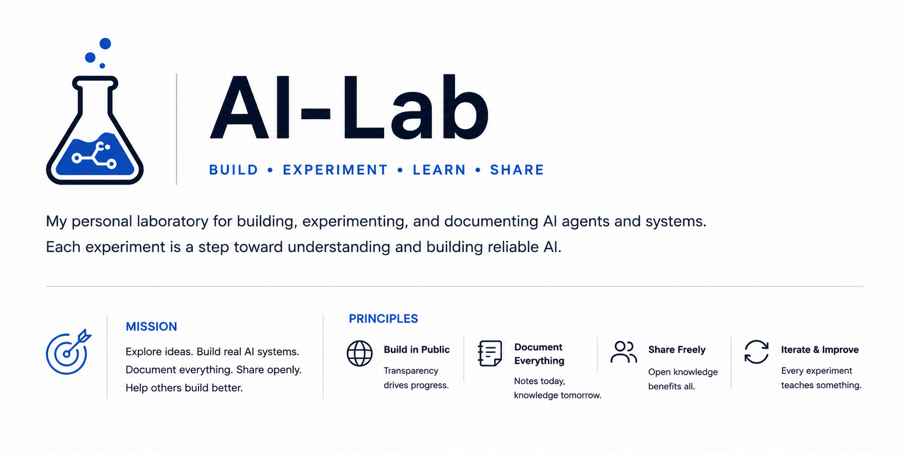

  

  
  

## 🚀 About

AI-Lab is my public laboratory for building, experimenting with, and documenting modern AI systems.

Instead of only sharing finished projects, I document the complete journey—including experiments, failures, architecture decisions, and lessons learned.

Every repository update represents another step toward building reliable production-ready AI systems.

Don't forget to [star (⭐) this repo](https://docs.github.com/en/get-started/exploring-projects-on-github/saving-repositories-with-stars?WT.mc_id=academic-105485-koreyst) and [fork this repo](https://github.com/hosseinisreza95/ai-lab/fork) to run the code.

## 🧪 Experiments

Every project in AI-Lab is treated as an experiment.  
Each experiment includes source code, documentation, lessons learned, and (when available) a companion YouTube video.

| # | Experiment | Code & Doc | Video |
|:-:|------------|:------:|:-----:|
| 001 | Code Agent | [Link](./001-code-agent/README.md) | [Video](https://www.youtube.com/watch?v=oOKBC57IeOI&list=PLFf9tFmijLOE) |
| 002 | Order Tracking Agent | [Link](./002-order-tracking-agent/README.md) | ⏳ |
| 003 | Multi-Agent Data Analyst | [Link](./003-multi-agent-data-analyst/README.md) | ⏳ |
| 004 | Field Service Technician RAG Assistant | [Link](./004-field-service-rag/README.md) | ⏳ |
| 005 | Industrial Maintenance Intervention Insights | [Link](./005-maintenance-intervention-insights/README.md) | ⏳ |
| 006 | Insurance Coverage Assistant | [Link](./006-insurance-coverage-assistant/README.md) | ⏳ |
| 007 | Food Service Demand & Ordering Agent | [Link](./007-food-service-ordering-agent/README.md) | ⏳ |
| 008 | Retail Supply Chain Delivery Forecasting | [Link](./008-supply-chain-forecasting-rag/README.md) | ⏳ |
| 009 | Finance: Credit Scoring, Risk & Forecasting | [Link](./009-finance-risk-forecasting/README.md) | ⏳ |
| 010 | NVIDIA 10-K RAG Evaluation | [Link](./010-nvidia-rag-eval/README.md) | ⏳ |
| ... | More experiments coming soon... | 🚧 | ⏳ |

## 📺 Follow the Journey

